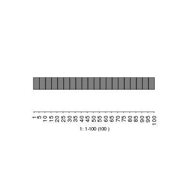

Basic guide to get started with gTrack
===============================

gTrack enables plotting of GRanges.  Each gTrack object wraps around a GRanges and specifies how that GRanges will be drawn.

gTrack objects are rendered with a call to plot().  The plot() call can be supplied with a second argument that specifies the coordinate of of specific windows / views on the genome that will rendered (also provided as a GRanges).

By default, plotting a gTrack object will render the entire genome that the gTrack lives in (which is specified by the seqinfo() property of the GRanges around which that gTrack was constructed). Basic formatting options include specifying colors, y axis coordinates (y.field), plotting ranges as rectangles vs circles bar plots.  Advanced options include drawing a triangular heatmap (a la Hi-C or linkage disequilibrium plots) and plotting directed acyclic graphs of intervals. 

Below are quick examples using synthetic data to illustrate basic gTrack features. 

::

    library(gUtils)
    library(gTrack)

We'll get started with a very simple example generating and plotting a GRanges of non-overlapping tiles.

.. ..

::

      ## using gUtils function gr.tile we make a simple width 5 tiling of an input with 100 gRanges
      ## In this example, the output will be 20 equal sized tiles
    
      gr <- gr.tile(GRanges(1, IRanges(1,100)), w=5)
        
      ## Plot the tiles along the "genome", which in this case is a 100 base seequence
      plot(gTrack(gr))

    
