How to Graph Super Enhancers
============================

To illustrate gTrack's capability in exploring data sets such as ChiP-Seq data

.. sourcecode:: r
    

    ## The methods section of http://www.nature.com/ng/journal/v48/n2/full/ng.3470.html stated
    ## that GISTIC analyses were performed on the TCGA data available on the TCGA copy number
    ## portal which is created by the Broad Institute of MIT and Harvard.
    
    ## After finding version 3.0 of the SNP pipeline on 22 October 2014, clicking on the IGV
    ## session and an XML document (http://portals.broadinstitute.org/tcga/gisticIgv/session.xml?analysisId=21&tissueId=548&type=.xml)
    ## was returned which stored the web path to the *.seg.gz file. I downloaded that and found
    ## that it stored the log2 ratios (tumor coverage / normal coverage).
    
    ## wget http://www.broadinstitute.org/igvdata/tcga/tcgascape/141024_update/all_cancers.seg.gz
    ## wget http://www.broadinstitute.org/igvdata/tcga/tcgascape/141024_update/sample_info.txt
    
    ## gzip -d all_cancers.seg.gz

.. sourcecode:: r
    

    ##############################                         ##############################
    
    ##############################    Starting Analysis    ##############################
    
    ##############################                         ##############################
    
    library(gTrack) ## main sauce. 
    library(gUtils) ## for dt2gr 
    
    ## Load coverage data into data.table. Very fast, thanks data.table.
    ## seg_data <- fread('../../inst/extdata/files/all_cancers.seg')
    
    seg_data[Log2.Ratio <= 0, data_sign := "deletion"]
    seg_data[Log2.Ratio > 0, data_sign := "insertion"]
    
    ## Coerce into GRanges from data.table because gTrack operates on GRanges.
    seg_ranges <- dt2gr(seg_data)
    
    ## first glimpse (gotta know what the data looks like). Probably should zoom in before even starting.

.. sourcecode:: r
    

    ## if you want the colors to be chosen automatically. 
    plot(gTrack(seg_ranges, y.field = 'Log2.Ratio', gr.colorfield = 'data_sign'))

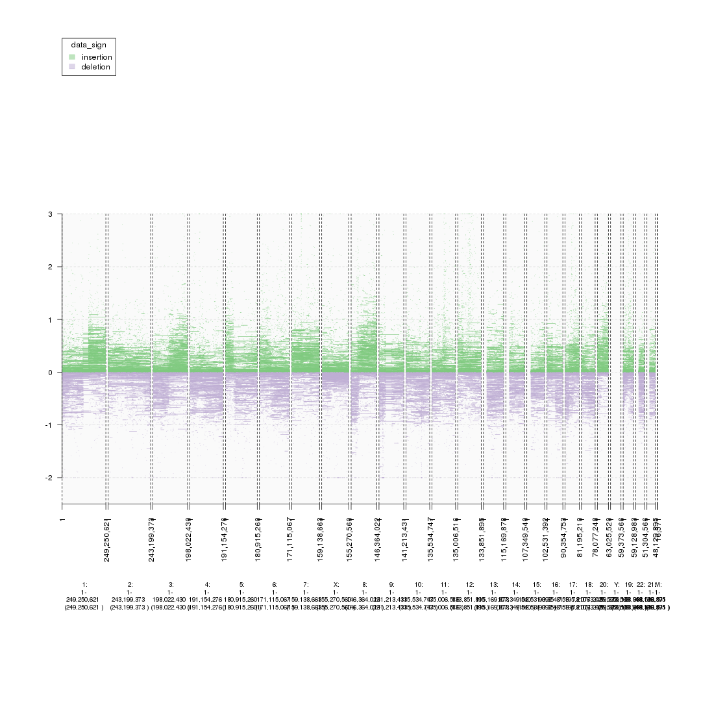

    plot of chunk starting_analysis_plot

.. sourcecode:: r
    

    ## if you want to manually set the colors. Better because red/blue can be chosen instead of some random colors.
    plot(gTrack(seg_ranges, y.field = 'Log2.Ratio', colormaps = list('data_sign' = c(insertion = "blue", deletion = "red"))))

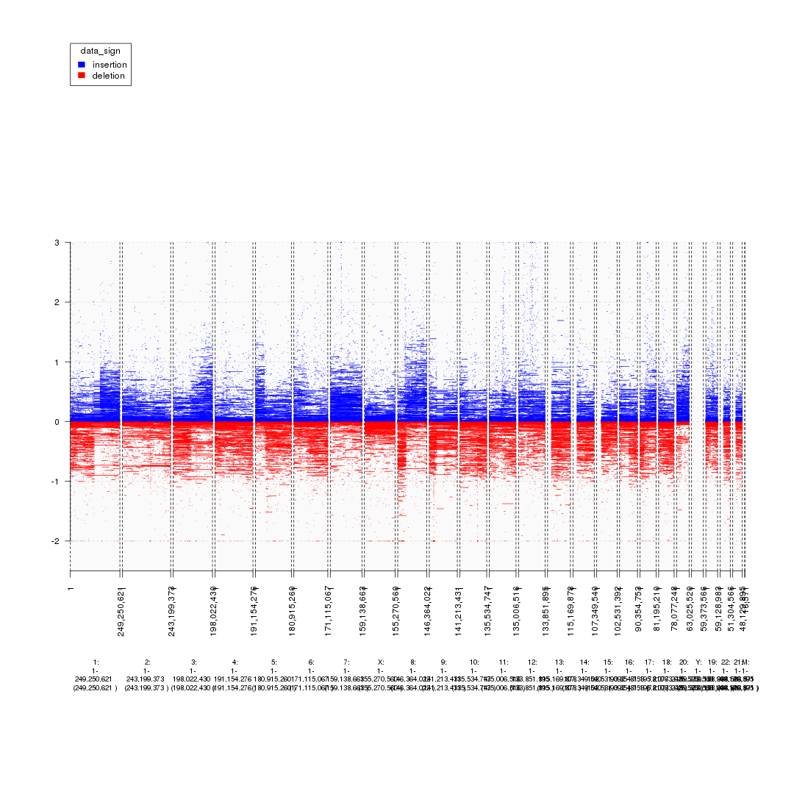

    plot of chunk starting_analysis_plot2

.. sourcecode:: r
    

    ## Subset to MYC enhancer amplification regions.
    seg_data_chrom8 <- seg_data[ Chromosome == 8]
    
    ## coerce into GRanges from data.table because gTrack operates on GRanges.
    seg_ranges_chrom8 <- dt2gr(seg_data_chrom8)

.. sourcecode:: r
    

    ## if you want to manually set the colors. Better because red/blue can be chosen instead of some random colors. 
    plot(gTrack(seg_ranges_chrom8, y.field = 'Log2.Ratio', colormaps = list('data_sign' = c(insertion = "blue", deletion = "red"))), win = seg_ranges_chrom8)

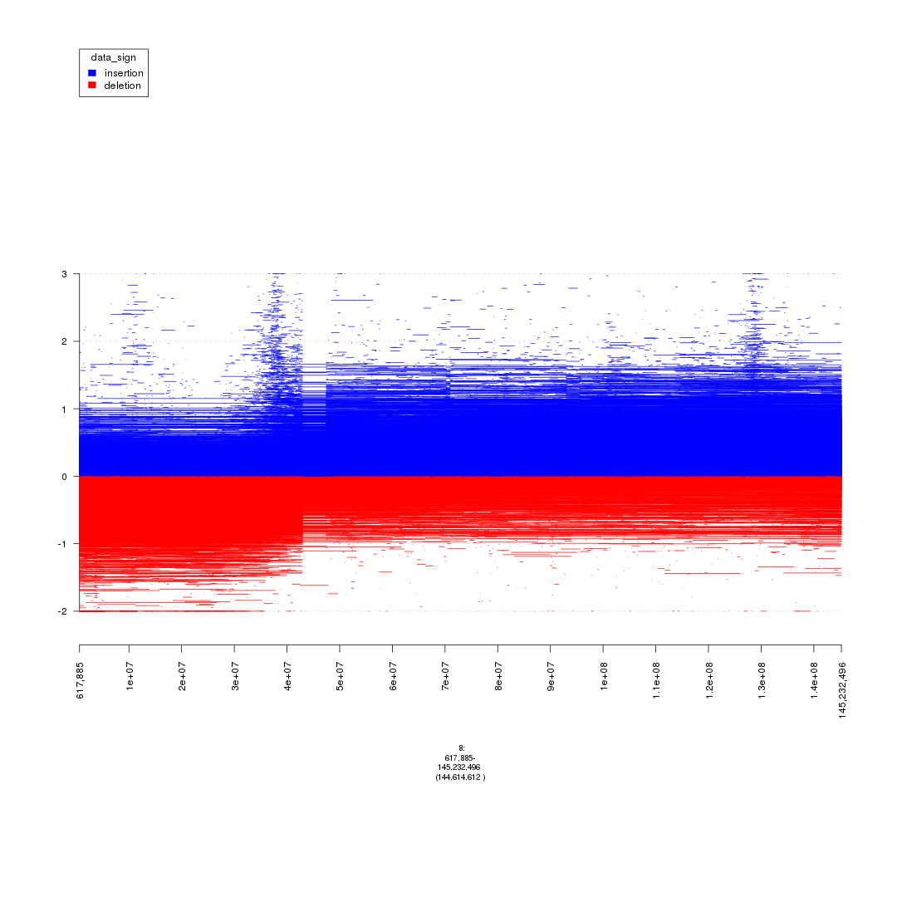

    plot of chunk starting_analysis_plot3

.. sourcecode:: r
    

    ##############################                         ##############################
    
    ##############################    Plot MYC Enhancers   ##############################
    
    ##############################                         ##############################
    
    ## first MYC(myc) (s)uper-(e)nhancer.
    myc_se <- parse.gr(c('8:129543949-129554294'))
    ## zoom into that region to view CNA.
    win <- myc_se
    plot(gTrack(seg_ranges_chrom8, y.field = 'Log2.Ratio', colormaps = list('data_sign' = c(insertion = "blue", deletion = "red"))), win)

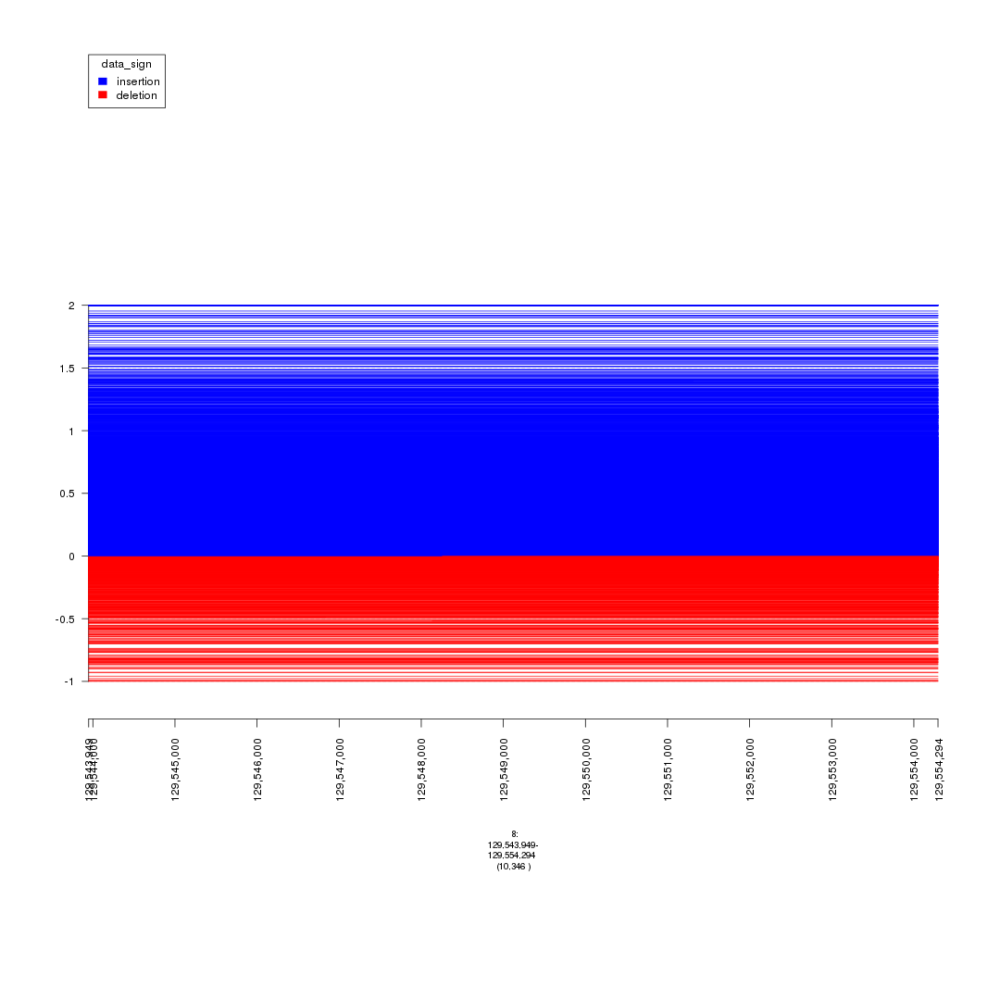

    plot of chunk plot_MYC_enhancers
.. sourcecode:: r
    

    ## second MYC super-enhancer
    myc_se <- parse.gr(c('8:129166547-129190290'))
    win <- myc_se
    plot(gTrack(seg_ranges_chrom8, y.field = 'Log2.Ratio', colormaps = list('data_sign' = c(insertion = "blue", deletion = "red"))), win)

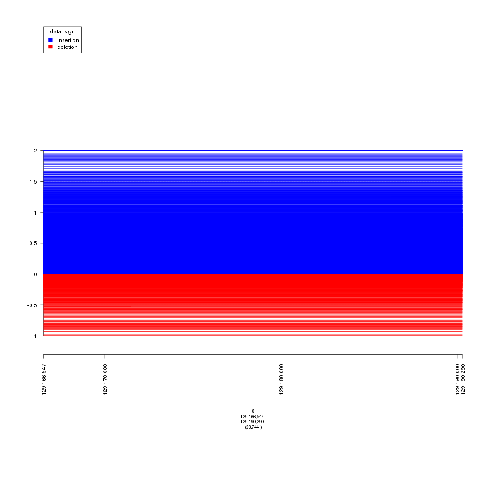

    plot of chunk plot_MYC_enhancers
.. sourcecode:: r
    

    ## it looks like both regions have focal insertions and deletions. 
    plot(gTrack(seg_ranges_chrom8, colormaps = list('data_sign' = c(insertion = "blue", deletion = "red"))), win = seg_ranges_chrom8+10e6)

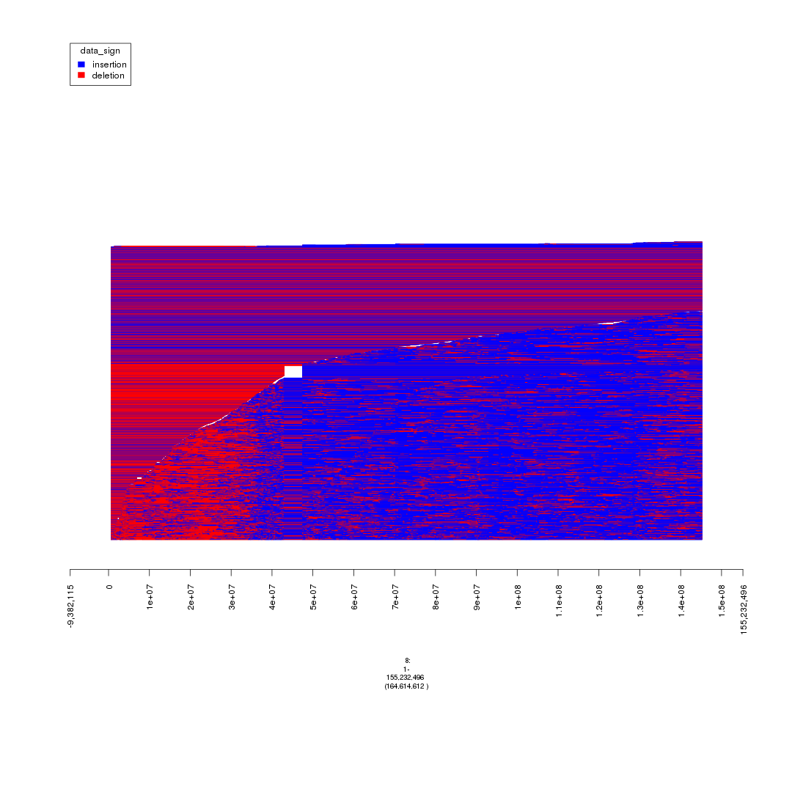

    plot of chunk plot_MYC_enhancers

.. sourcecode:: r
    

    ##############################                         ##############################
    
    ##############################    Setting Thresholds   ##############################
    
    ##############################                         ##############################
    
    ## max width is 50MB to remove very broad copy number changes.
    ## min width is 20KB to exclude artifacts.
    
    seg_data_chrom8 <- seg_data_chrom8[End.bp - Start.bp <= 30e3]
    seg_ranges_chrom8 <- dt2gr(seg_data_chrom8)
    plot(gTrack(seg_ranges_chrom8, colormaps = list('data_sign' = c(insertion = "blue", deletion = "red"))), win = seg_ranges_chrom8+10e6)

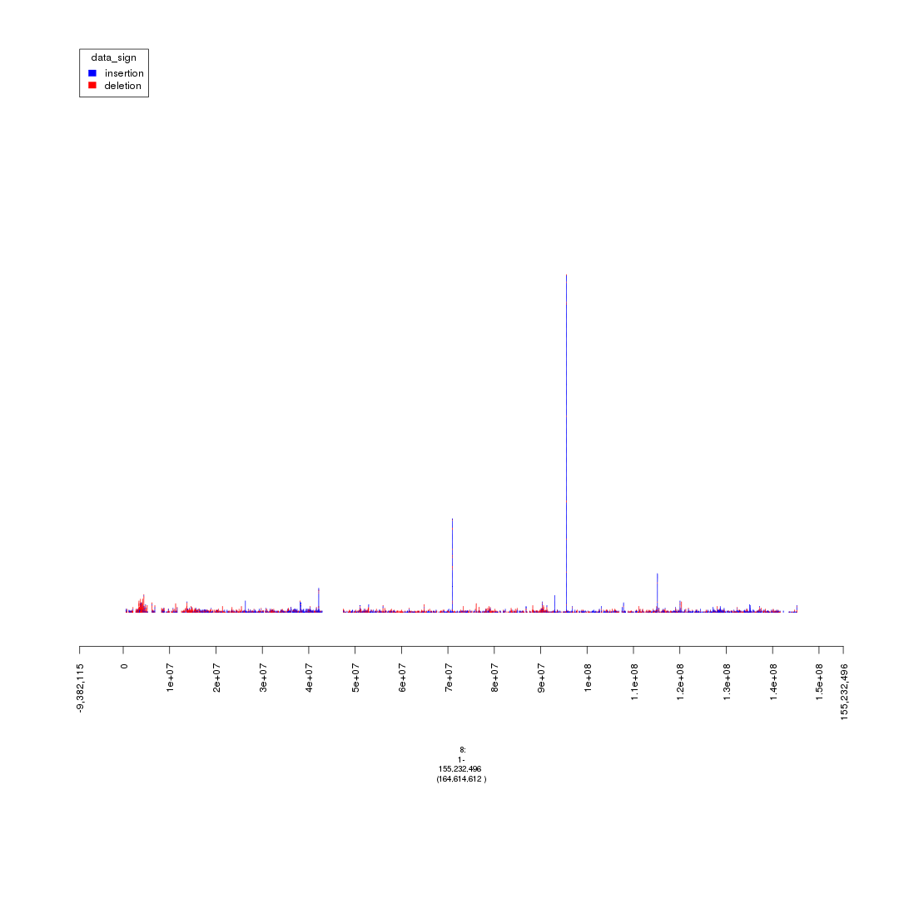

    plot of chunk setting_thresholds

.. sourcecode:: r
    

    ## explore data set for determining threshold for log2 ratio.
    
    ##############################                         ##############################
    
    ##############################       Random Fact       ##############################
    
    ##############################                         ##############################
    
    ## There are more insertions than deletions.
    sorted_ratios <- sort(seg_data_chrom8$'Log2.Ratio')
    length(sorted_ratios) ## 70K

::

    ## [1] 4458

.. sourcecode:: r
    

    #### -1 and 2
    seg_data_chrom8_2 <- seg_data_chrom8[Log2.Ratio >= -1 & Log2.Ratio <= 2]
    seg_ranges_chrom8_2 <- dt2gr(seg_data_chrom8_2)
    
    plot(gTrack(seg_ranges_chrom8_2, colormaps = list('data_sign' = c(insertion = "blue", deletion = "red"))), win = seg_ranges_chrom8_2+10e6)

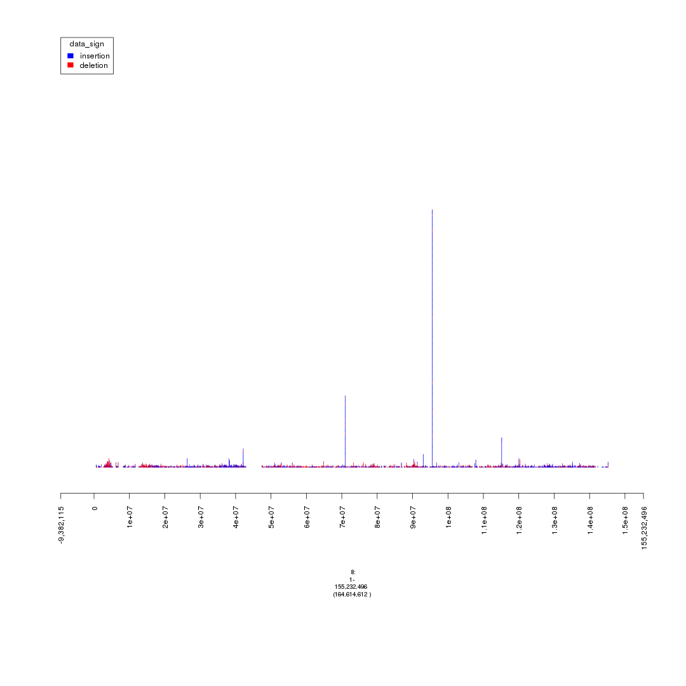

    plot of chunk random_fact
.. sourcecode:: r
    

    #############################                          ################################
                 # Not much of a change, will ignore setting thresholds for Log2.Ratio
    ############################                           ################################

Reading bigWig in gTrack
~~~~~~~~~~~~~~~~~~~~~~~~

.. sourcecode:: r
    

    ## bigWig downloaded from https://www.encodeproject.org/experiments/ENCSR000AUI/
    
    ## fold change.
    plot(gTrack('~/my_git_packages/super_enhancers/db/ENCFF038AQV.bigWig', color = 'green'), win = parse.gr('8:128635434-128941434'))

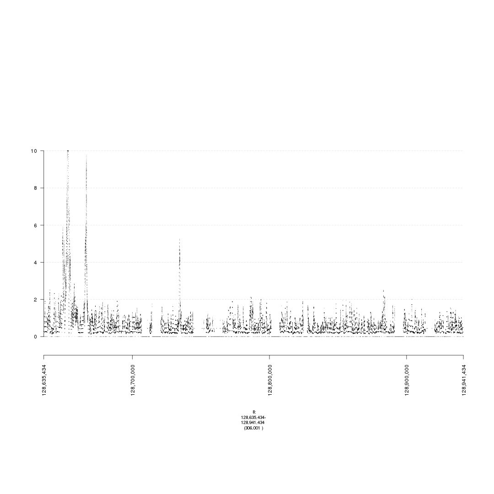

    plot of chunk bigWig
.. sourcecode:: r
    

    ### store gencode genes.
    ge = track.gencode()

::

    ## Pulling gencode annotations from /gpfs/commons/groups/imielinski_lab/lib/R-3.3.0/gTrack/extdata/gencode.composite.collapsed.rds

.. sourcecode:: r
    

    ### Plot ENCODE, peak super-enhancer, and copy number data. 
    ### without super-enhancers.
    
    plot(c(gTrack('~/my_git_packages/super_enhancers/db/ENCFF038AQV.bigWig', color = 'green'), gTrack(seg_ranges_chrom8, colormaps = list('data_sign' = c(insertion = "blue", deletion = "red"))), ge), win = parse.gr('8:128635434-128941434'))

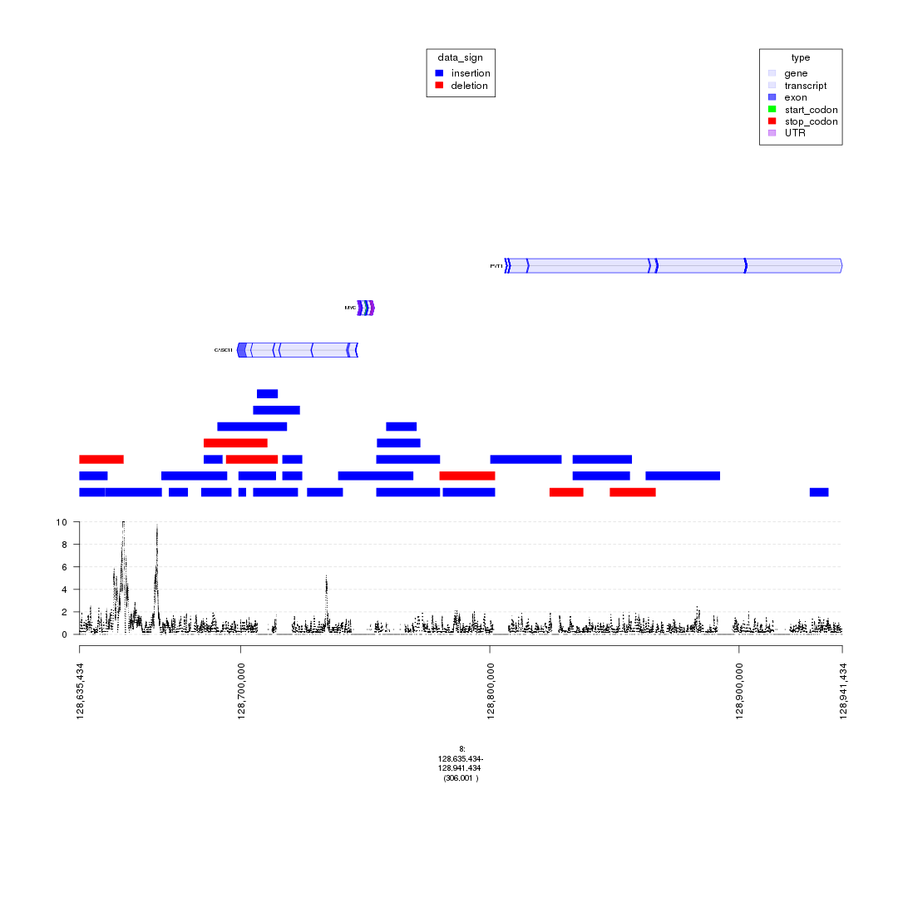

    plot of chunk bigWig
.. sourcecode:: r
    

    ### with super-enhancers. 
    plot(c(gTrack('~/my_git_packages/super_enhancers/db/ENCFF038AQV.bigWig', color = 'green', bar = TRUE), gTrack(seg_ranges_chrom8, colormaps = list('data_sign' = c(insertion = "blue", deletion = "red"))), ge), win = parse.gr('8:128735434-129641434'))

.. figure:: figure/bigWig-3.png
    :alt: plot of chunk bigWig

    plot of chunk bigWig
.. sourcecode:: r
    

    ### Split the copy number data into two objects - one for insertions & other for deletions.
    
    seg_data_chrom8_insertions <- seg_data_chrom8[data_sign == "insertion"]
    seg_data_chrom8_deletions <- seg_data_chrom8[data_sign == "deletion"]
    
    seg_ranges_chrom8_insertions <- dt2gr(seg_data_chrom8_insertions)
    seg_ranges_chrom8_deletions <- dt2gr(seg_data_chrom8_deletions)
    
    ### with super-enhancers & gencode & ChIP-seq & insertions/deletions split.
    plot(c(gTrack('~/my_git_packages/super_enhancers/db/ENCFF038AQV.bigWig', color = 'green', bar = TRUE), gTrack(seg_ranges_chrom8_insertions, col = "blue"), gTrack(seg_ranges_chrom8_deletions, col = "red"), ge), win = parse.gr('8:128735434-129641434'))

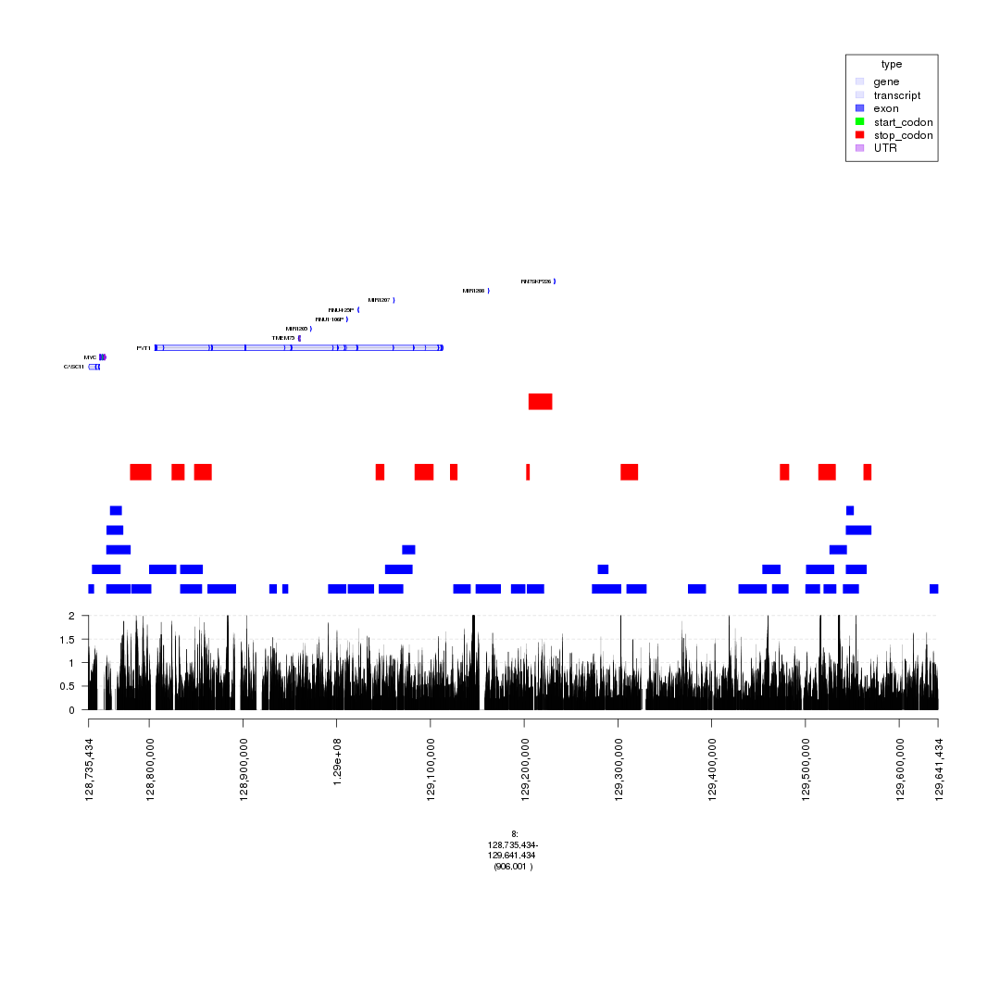

    plot of chunk bigWig
.. sourcecode:: r
    

    plot(gTrack(seg_ranges_chrom8_insertions, y.field = "Log2.Ratio", col = "blue"), win = parse.gr('8:128735434-129641434'))

.. figure:: figure/bigWig-5.png
    :alt: plot of chunk bigWig

    plot of chunk bigWig

.. sourcecode:: r
    

    ### Filtering broad events
    seg_data_chrom8_deletions2 <- seg_data_chrom8_deletions[Log2.Ratio >= -0.6]
    seg_data_chrom8_insertions2 <- seg_data_chrom8_insertions[Log2.Ratio >= 0.6]
    
    seg_ranges_chrom8_insertions <- dt2gr(seg_data_chrom8_insertions)
    seg_ranges_chrom8_deletions <- dt2gr(seg_data_chrom8_deletions)
    
    plot(c(gTrack('~/my_git_packages/super_enhancers/db/ENCFF038AQV.bigWig', color = 'green', bar = TRUE), gTrack(seg_ranges_chrom8_insertions, col = "blue"), gTrack(seg_ranges_chrom8_deletions, col = "red"), ge), win = parse.gr('8:128735434-129641434'))

    plot of chunk filter_broad_events
.. sourcecode:: r
    

    ### Replicable pipeline
    
    ## Subset to MYC enhancer amplifications regions.
    seg_data_chrom8 <- seg_data[ Chromosome == 8]
    ## coerce data.table into GRanges because gTrack operates on GRanges. 
    seg_ranges_chrom8 <- dt2gr(seg_data_chrom8)
    
    seg_data_chrom8 <- seg_data_chrom8[End.bp - Start.bp <= 10e6]
    
    seg_data_chrom8_deletions <- seg_data_chrom8[Log2.Ratio <= 0, data_sign := "deletion"]
    seg_data_chrom8_insertions <- seg_data_chrom8[Log2.Ratio > 0, data_sign := "insertion"]
    
    
    seg_data_chrom8_insertions <- seg_data_chrom8[data_sign == "insertion"]
    seg_data_chrom8_deletions <- seg_data_chrom8[data_sign == "deletion"]
    
    gray = 'gray20'
    gt.h3k36 = gTrack('~/DB/Roadmap/consolidated//E114-H3K36me3.pval.signal.bigwig', name = 'H3K36me3', bar = TRUE, col = gray)
    gt.h3k4 = gTrack('~/DB/Roadmap/consolidated//E114-H3K4me3.pval.signal.bigwig', name = 'H3K4me3', bar = TRUE, col = gray)
    gt.enh = gTrack('~/DB/Roadmap/consolidated//E114-H3K27ac.pval.signal.bigwig', name = 'H3K27Ac', bar = TRUE, col = gray)
    gt.open = gTrack('~/DB/Roadmap/consolidated//E114-DNase.pval.signal.bigwig', name = 'DNAase', bar = TRUE, col = gray)
    gt.rnapos = gTrack('~/DB/Roadmap/consolidated/E114.A549.norm.pos.bw', name = 'RNAseq+', bar = TRUE, col = gray)
    gt.rnaneg = gTrack('~/DB/Roadmap/consolidated/E114.A549.norm.neg.bw', name = 'RNAseq-', bar = TRUE, col = gray, y0 = 0, y1 = 1200)
    
    THRESH = 1
    seg_data_chrom8_deletions <- seg_data_chrom8_deletions[Log2.Ratio >= -THRESH]
    seg_data_chrom8_insertions <- seg_data_chrom8_insertions[Log2.Ratio >= THRESH]
    seg_ranges_chrom8_insertions <- dt2gr(seg_data_chrom8_insertions)
    seg_ranges_chrom8_deletions <- dt2gr(seg_data_chrom8_deletions)
    plot(c(gTrack('~/my_git_packages/super_enhancers/db/ENCFF038AQV.bigWig', color = 'green', bar = TRUE), gTrack(seg_ranges_chrom8_insertions, col = "blue"), gTrack(seg_ranges_chrom8_deletions, col = "red"), ge), win = parse.gr('8:128735434-129641434'))

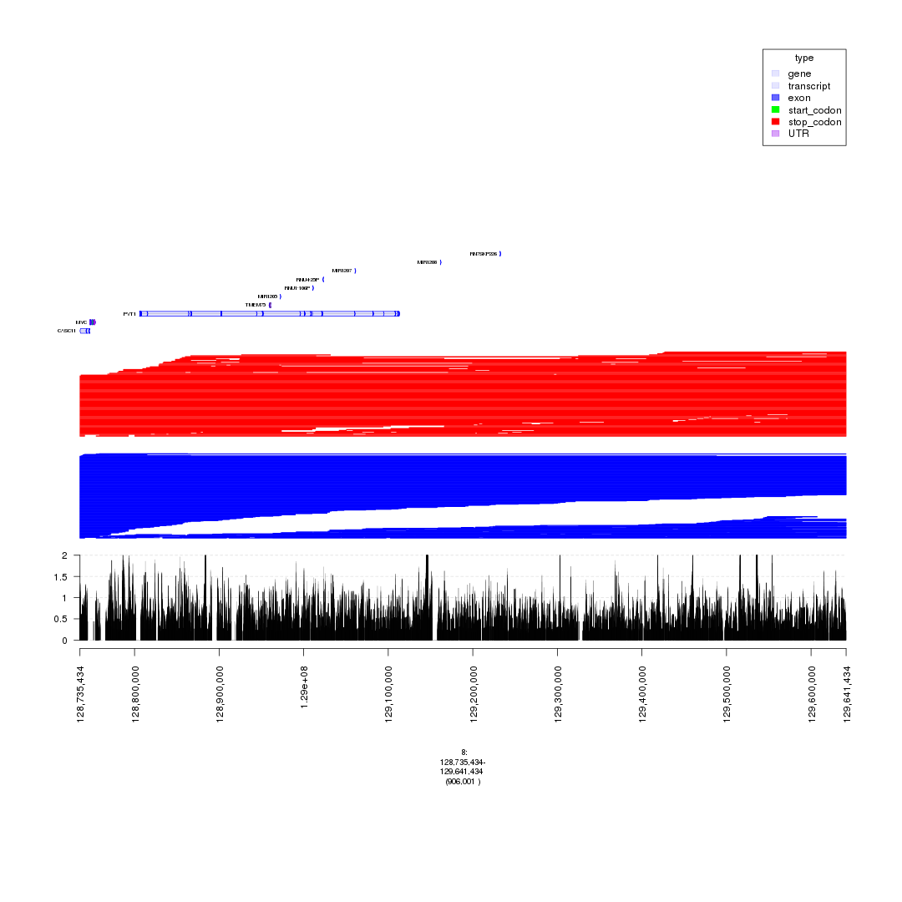

    plot of chunk filter_broad_events
.. sourcecode:: r
    

    acov = as(coverage(seg_ranges_chrom8_insertions), 'GRanges')
    dcov = as(coverage(seg_ranges_chrom8_deletions), 'GRanges')
    plot(c(gt.rnapos, gt.enh, gTrack('~/my_git_packages/super_enhancers/db/ENCFF038AQV.bigWig', color = 'green', bar = TRUE), gTrack(acov, 'score', bar = TRUE), gTrack(dcov, 'score', bar = TRUE),  gTrack(seg_ranges_chrom8_insertions, col = "blue"), gTrack(seg_ranges_chrom8_deletions, col = "red"), ge), win = parse.gr('8:128735434-129641434'))+1e6

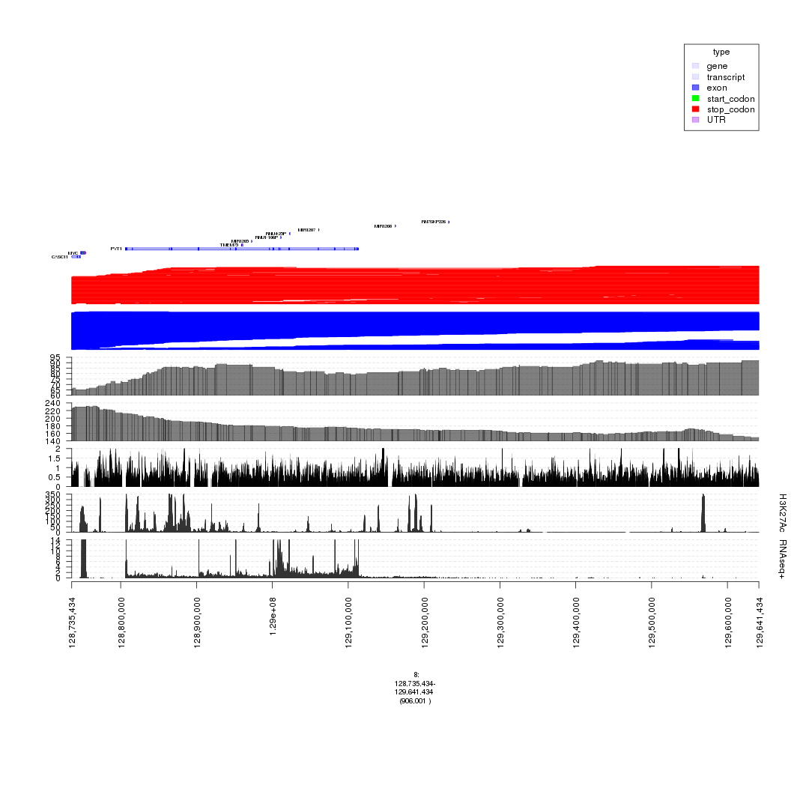

    plot of chunk filter_broad_events

::

    ## numeric(0)

