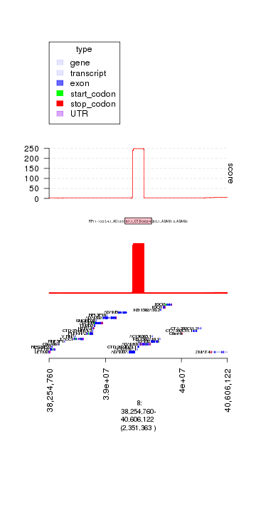
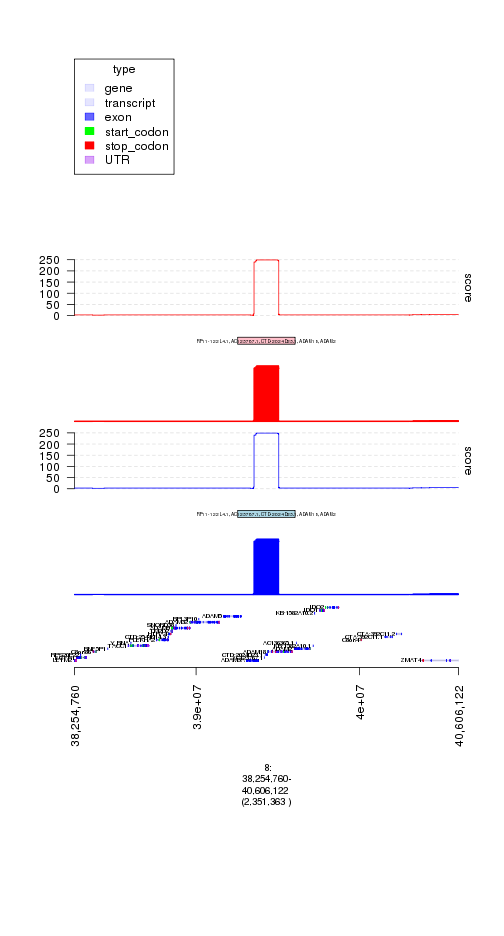
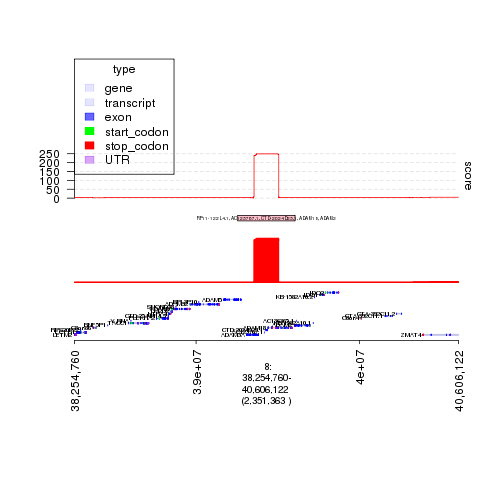
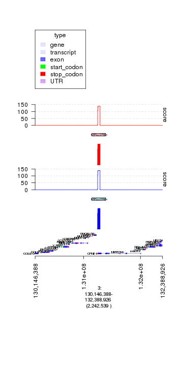
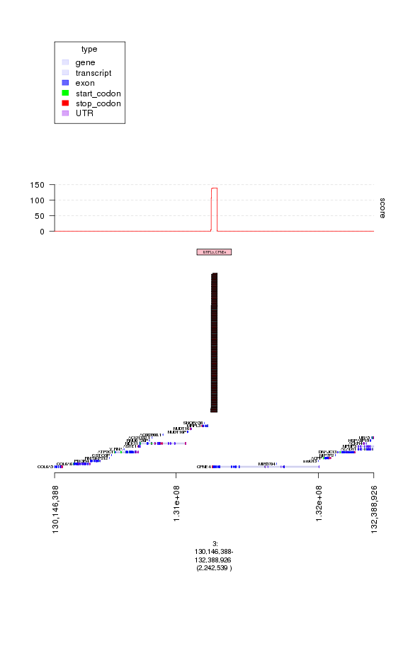

How to Graph CNV Data
=====================

.. sourcecode:: r
    

    opts_chunk$set(fig.width=8, fig.height=13)

.. sourcecode:: r
    

    #### make sure to load gUtils
    library(gTrack)
    #### load in SCNA data
    #### these are level 3 segments from over 1600 TCGA breast cancer cases
    #### downloaded from the TCGA and converted to a single GRanges object 
    scna = seg2gr(readRDS(system.file(c('extdata/files'), 'scna.rds', package = 'gTrack')))
    
    #### we define amplification events and deletion events
    #### and then do a simple recurrence analysis on amplifications
    
    #### amplification events are defined using %Q% gUtils operator to filter
    #### on scna metadata for segments with seg.mean greater than 1
    #### greater than 50 markers and width less than 1MB
     amps = scna %Q% (seg.mean>1 & num.mark > 50 & width < 1e7)
    
    #### apply a similar filter to define deletions
     dels = scna %Q% (seg.mean<(-1) & num.mark > 50 & width < 1e7)
    
    #### compute the amplification "score" as the total number of amplification
    #### events in a given region
     amp.score = as(coverage(amps), 'GRanges')
    
    #### define the peaks of amplification as the 100 regions with
    #### the highest amplification score
     amp.peaks = amp.score %Q% (rev(order(score))) %Q% (1:100)
    
    #### "reduce" or merge the top peaks to find areas of recurrent amplification
    amp.peaks = reduce(amp.peaks+1e5) %$% amp.peaks %Q% (rev(order(score)))
    
    ### do a similar analysis for dels
    del.score = as(coverage(dels), 'GRanges')
    del.peaks = del.score %Q% (rev(order(score))) %Q% (1:100)
    del.peaks = reduce(del.peaks+1e5) %$% del.peaks %Q% (rev(order(score)))
    
    #### load in GRanges of GENCODE genes
    genes = readRDS(system.file("extdata", 'genes.rds', package = "gTrack"))
    
    #### use %$% operator to annotate merged amp and del peaks with "gene name" metadata
    amp.peaks = amp.peaks %$% genes[, 'gene_name']
    del.peaks = del.peaks %$% genes[, 'gene_name']
    
    ### now that we've computed scores and annotated peaks
    ### we want to inspect these peaks and plot them with gTrack
    
    ### load in precomputed gTrack of hg19 GENCODE annotation
    ### (note this is different from the GENCODE genes which is a GRanges
    ### we loaded in a previous line .. this is purely for visualization)
    ge = track.gencode()

::

    ## Pulling gencode annotations from /data/research/mski_lab/Software/R/gTrack/extdata/gencode.composite.collapsed.rds

.. sourcecode:: r
    

    #### build a gTrack of amps colored in red with black border
    #### and one of dels colored in blue 
    gt.amps = gTrack(amps,  col = 'red', name = 'Amps')
    gt.dels = gTrack(dels, col = 'blue', name = 'Dels')
    
    #### build a gTrack of amp and del score as a line plot
    gt.amp.score = gTrack(amp.score, y.field = 'score',
        col = 'red', name = 'Amp score', line = TRUE)
    gt.del.score = gTrack(del.score, y.field = 'score',
        col = 'blue', name = 'Amp score', line = TRUE)
    
    #### build a gTrack of peaks of amp and del peaks
    gt.amp.peaks = gTrack(amp.peaks, gr.labelfield = 'gene_name', 
        col = 'pink', border = 'black', name = 'Amp peaks', height = 5)
    gt.del.peaks = gTrack(del.peaks, gr.labelfield = 'gene_name',
        col = 'lightblue', border = 'black', name = 'Amp peaks', height = 5)
    
    ### let's look at the top amplification peak
    amp.peaks[1]

::

    ## GRanges object with 1 range and 2 metadata columns:
    ##       seqnames               ranges strand |     score
    ##          <Rle>            <IRanges>  <Rle> | <numeric>
    ##   [1]        8 [39254760, 39606122]      * |  253.9448
    ##                                                    gene_name
    ##                                                  <character>
    ##   [1] RP11-122L4.1, AC123767.1, CTD-2024D23.1, ADAM18, ADAM2
    ##   -------
    ##   seqinfo: 24 sequences from an unspecified genome

.. sourcecode:: r
    

    ### interesting! this looks like a novel peak with genes that have
    ### not previously been associated with breast cancer
    ### ("RP11-122L4.1, AC123767.1, CTD-2024D23.1, ADAM18, ADAM2")
    
    ### let's look at the data supporting this peak - including
    ### the underlying amp events, amp score, and peak region boundary

.. sourcecode:: r
    

    plot(c(ge, gt.amps, gt.amp.peaks, gt.amp.score), amp.peaks[1]+1e6)

    plot of chunk plot1

.. sourcecode:: r
    

    ### hmm, something looks suspicious since all the segments have the same
    ### start and end.  These could be copy number artifacts that often arise
    ### in segmentation of array data, sometimes due to germline copy number
    ### polymorphisms. 
    
    
    ### to see this pattern more clearly, let's enlarge the
    ### amplification track, also add the deletion data, and replot
    my.gt = c(ge, gt.dels, gt.del.peaks, gt.del.score,
                gt.amps, gt.amp.peaks, gt.amp.score)

.. sourcecode:: r
    

    plot(my.gt, amp.peaks[1]+1e6)

    plot of chunk plot2

.. sourcecode:: r
    

    ### interesting so this appears to also be a peak in the deletion analysis
    ### and a region that accumulates both amplification and deletion calls in
    ### many tumor samples.  This could either be a copy number polymorphism
    ### or an artifact.
    
    ### let's load in a track of copy events from the Database of Germline Variation
    ### which catalogues common copy changes in human populations
    dgv = readRDS(system.file(c('extdata/files'), 'dgv.rds', package = 'gTrack'))

.. sourcecode:: r
    

    plot(c(ge, gt.amps, gt.amp.peaks, gt.amp.score), amp.peaks[1]+1e6)

    plot of chunk plot3

.. sourcecode:: r
    

    ### indeed looks like this is a region around which people have previously
    ### seen germline copy number variations, so it's likely an artifact
    
    ### let's look at the next amp peak
    print(amp.peaks[2])

::

    ## GRanges object with 1 range and 2 metadata columns:
    ##       seqnames               ranges strand |     score
    ##          <Rle>            <IRanges>  <Rle> | <numeric>
    ##   [1]       11 [68809874, 69577804]      * |  102.4002
    ##                                                                                                                                                     gene_name
    ##                                                                                                                                                   <character>
    ##   [1] TPCN2, MIR3164, RP11-554A11.7, RP11-554A11.8, MYEOV, RP11-211G23.2, RP11-211G23.1, AP000439.1, AP000439.2, AP000439.5, AP000439.3, CCND1, ORAOV1, FGF19
    ##   -------
    ##   seqinfo: 24 sequences from an unspecified genome

.. sourcecode:: r
    

    ### this peak includes  CCND1 in addition to other genes
    ### this peak is known to be a target of amplification in breast cancer
    ### and so likely real
    
    ### let's plot it:

.. sourcecode:: r
    

    plot(my.gt, amp.peaks[2]+1e6)

::

    ## budget ..

::

    ## Error in (function (...) : all elements in '...' must be GRanges objects

    plot of chunk plot4

.. sourcecode:: r
    

    ### unlike the previous peak this has an enrichment of amplifications vs deletions
    ### not known have a bunch of germline copy number changes in the DGV
    
    ### let's zoom in on the individual events, getting rid of the other tracks
    ### increase the height of the amp track
    ### and adding a black border to better define event boundaries
    gt.amps$border = 'black'
    gt.amps$height = 30
    my.gt = c(ge, gt.amps, gt.amp.peaks, gt.amp.score)

.. sourcecode:: r
    

    plot(my.gt, amp.peaks[2]+1e6)

    plot of chunk plot5

.. sourcecode:: r
    

    ### here each red segment is a somatic amplification or gain in a different patietn
    ### the peak looks real, in that the events have relatively random starts
    ### and ends and cluster around this target gene. 

