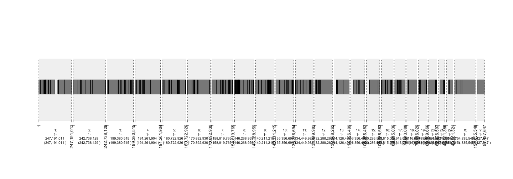
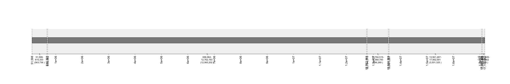
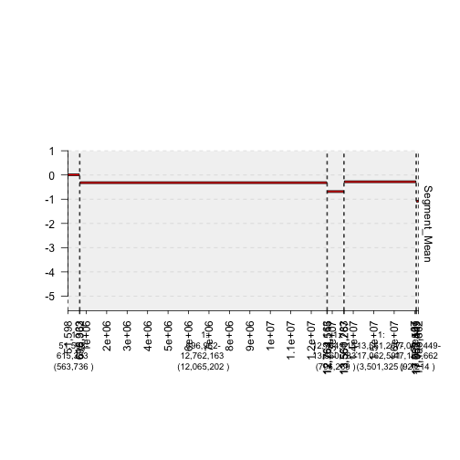
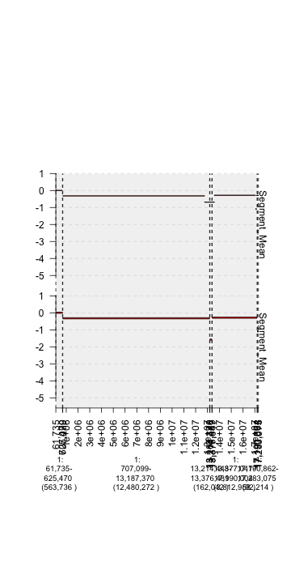
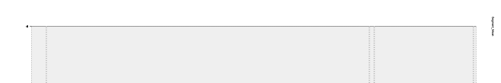
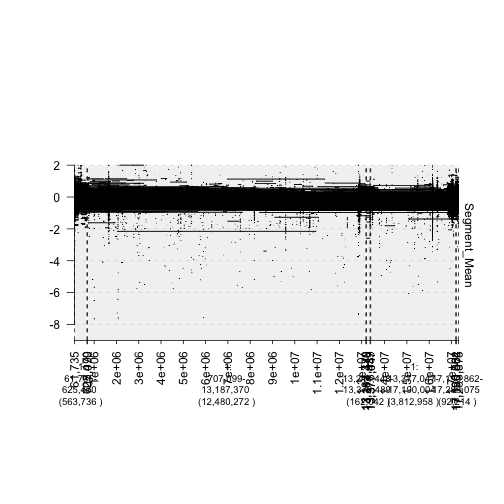
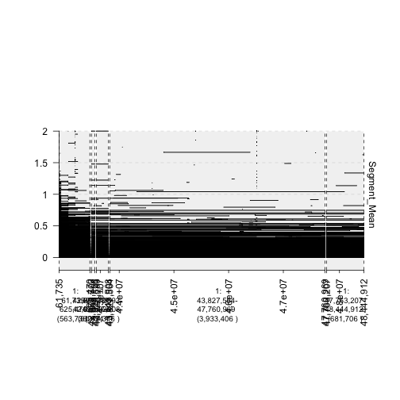
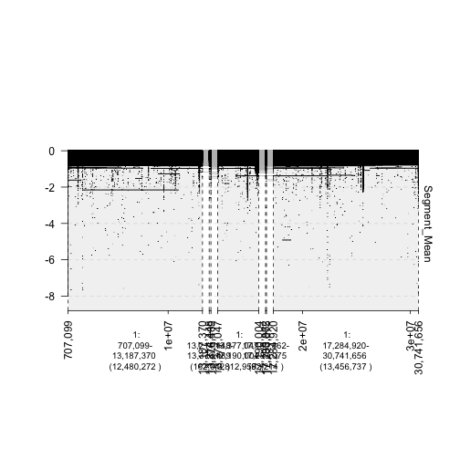

Vignette Using CNV Data
=======================

**Operations on CNV data of one sample** 

.. sourcecode:: r
    

    library(gUtils)
    library(gTrack)
    options(width = 150)
    
    setwd("~/Documents/gTrack/gTrack/")
    ##load data from TCGA
    
    tcgaData <- read.delim("inst/extdata/BEAUX_p_TCGA_b109_SNP_2N_GenomeWideSNP_6_A01_772082.hg18.seg.txt")
    
    ## convert data.frame to GRanges object
    
    tcgagr <- GRanges(tcgaData)
    
    # wrap gTrack around TCGA GRanges object
    
    tcgagt <- gTrack(tcgagr)

.. sourcecode:: r
    

    # plot gTrack object
    
    plot(tcgagt)

    plot of chunk plot-entireData

.. sourcecode:: r
    

    # Changed default number of windows (from entire genome to the first five windows).
    # Windows argument requires a subset of a GRanges Object. Check documentation for more details.
    plot(tcgagt , window = tcgagr[1:5])

    plot of chunk plot-subsetofData

.. sourcecode:: r
    

    # use amplifications/deletions as y-values
    tcgagt <- gTrack(tcgagr , y.field="Segment_Mean")
    plot(tcgagt , windows = tcgagr[1:5] , col = "red")

    plot of chunk plot-amplifcations

.. sourcecode:: r
    

    # add a second sample to the graph
    # create gTrack object for sample
    
    setwd("~/Documents/gTrack/gTrack/")
    tcgaData2 <- read.delim("inst/extdata/BEAUX_p_TCGA_b109_SNP_2N_GenomeWideSNP_6_A01_772082.hg19.seg.txt")
    tcgagr2 <- GRanges(tcgaData2)
    tcgagt2 <- gTrack(tcgagr2 , y.field="Segment_Mean")

.. sourcecode:: r
    

    # plot the two samples
    plot(c(tcgagt2 , tcgagt), windows = tcgagr2[1:5] , col = "red")

    plot of chunk plot-twoSamples

.. sourcecode:: r
    

    # physically separate gaps between tracks
    plot(c(tcgagt2 , tcgagt), windows = tcgagr2[1:5] , col = "red" , ygap = 5)

::

    ## Warning in ywid * grl.segs$ywid: longer object length is not a multiple of shorter object length

    ## Warning in ywid * grl.segs$ywid: longer object length is not a multiple of shorter object length

    plot of chunk plot-ygap

.. sourcecode:: r
    

    # study of the CNVs in breast cancer
    setwd("~/Documents/gTrack/gTrack/inst/extdata/Level_3")
    fn = list.files()
    
    # create data.tables for each patient but, combine them into one HUGE data.table using rbindlist
    dt = rbindlist(lapply(fn , function(x) fread(x , colClasses = "character")[ , file:=x]))
    
    # certain arguments (window) of gTrack require numeric vectors. Thus, "character" vectors need
    # to be converted into "numeric" vectors.
    
    dt$Start = type.convert(dt$Start)
    dt$End = type.convert(dt$End)
    
    # because we are graphing segment mean, that column also needs to be "numeric"
    dt$Segment_Mean = type.convert(dt$Segment_Mean)
    
    # convert data.table into GRanges object
    dtgr = GRanges(dt)
    
    # wrap a gTrack object around it and plot
    dtgt <- gTrack(dtgr , y.field = "Segment_Mean")

.. sourcecode:: r
    

    plot(dtgt , window = dtgr[1:5])

    plot of chunk plot-allSamples

.. sourcecode:: r
    

    # show amplifications only (use gUtils operators!)
    dtgr = dtgr %Q% (Segment_Mean > 0)
    dtgt <- gTrack(dtgr , y.field = "Segment_Mean")

.. sourcecode:: r
    

    plot(dtgt , window = dtgr[1:5])

    plot of chunk plot-amplificationsAll

.. sourcecode:: r
    

    # show deletions only (again, use gUtils operators!)
    
    # recreate the original GRanges object
    dtgr = GRanges(dt)
    # subset properly
    dtgr = dtgr %Q% (Segment_Mean < 0)
    dtgt <- gTrack(dtgr , y.field = "Segment_Mean")

.. sourcecode:: r
    

    plot(dtgt , window = dtgr[1:5])

    plot of chunk plot-deletionsAll
