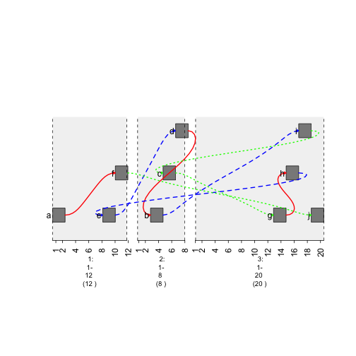

How to Create Graphs
=========================================

During chromosomal rearrangements, translocations may occur and graphing such a phenomenon is possible with gTrack. However, the **edges** parameter must be used. This vignette will explain how to prepare a graph.  

Edges Parameter
~~~~~~~~~~~~~~~

In order to create a connected graph in gTrack, the **edges** parameter of gTrack must be supplied a matrix or a data frame of connections. 

.. sourcecode:: r
    

    ##create a GRanges object storing 10 sequences. These sequences will serve as nodes for the graph. 
    gr <- GRanges(seqnames = Rle(c("chr1" , "chr2" , "chr1" , "chr3") ,
      c(1,3,2,4)), ranges = IRanges(c(1,3,5,7,9,11,13,15,17,19) ,
      end = c(2,4,6,8,10,12,14,16,18,20),
      names = head(letters,10)),
      GC=seq(1,10,length=10),
      name=seq(5,10,length=10))
    
    gr

::

    ## GRanges object with 10 ranges and 2 metadata columns:
    ##     seqnames    ranges strand |        GC             name
    ##        <Rle> <IRanges>  <Rle> | <numeric>        <numeric>
    ##   a     chr1  [ 1,  2]      * |         1                5
    ##   b     chr2  [ 3,  4]      * |         2 5.55555555555556
    ##   c     chr2  [ 5,  6]      * |         3 6.11111111111111
    ##   d     chr2  [ 7,  8]      * |         4 6.66666666666667
    ##   e     chr1  [ 9, 10]      * |         5 7.22222222222222
    ##   f     chr1  [11, 12]      * |         6 7.77777777777778
    ##   g     chr3  [13, 14]      * |         7 8.33333333333333
    ##   h     chr3  [15, 16]      * |         8 8.88888888888889
    ##   i     chr3  [17, 18]      * |         9 9.44444444444444
    ##   j     chr3  [19, 20]      * |        10               10
    ##   -------
    ##   seqinfo: 3 sequences from an unspecified genome; no seqlengths

.. sourcecode:: r
    

    ## Specify links between nodes using a matrix. Numeric 1s refer to a connection while conversely with 0s. 
    
    ##create an N*N matrix filled with 0s.
    graph = matrix(0 , nrow = 10 , ncol = 10)
    
    ##set certain indices to 1.
    graph[1,3]=1
    graph[1,10]=1
    graph[2,5]=1
    graph[2,8]=1
    graph[3,5]=1
    graph[4,1]=1
    graph[4,2]=1
    graph[4,6]=1
    graph[4,9]=1
    graph[5,1]=1
    graph[5,2]=1
    graph[5,4]=1
    graph[8,1]=1
    graph[8,2]=1
    graph[9,1]=1
    graph[10,1]=1

.. sourcecode:: r
    

    ##use edges parameter to create graph. 
    plot(gTrack(gr , edges = graph , stack.gap = 5))

.. figure:: figure/plot1 -1.png
    :alt: plot of chunk plot1 

    plot of chunk plot1 

Customizing a Graph 
~~~~~~~~~~~~~~~~~~~

If a **matrix** is used to create a graph, color and style of edges cannot be specified.Instead of using a **matrix**, a data frame can be used to specify those attributes. 

.. sourcecode:: r
    

    ##the "from" column specifies the beginning node (range).
    ##the "to" column specifies the end node (range).
    ##the "col" specifies the color of the edge.
    graph = data.frame(from = 1:9, to = c(6,9,7,2,4,10,8,5,3) , col = c('red', 'blue', 'green'))

.. sourcecode:: r
    

    plot(gTrack(gr , edges = graph , stack.gap = 5))

.. figure:: figure/colored-graph-1.png
    :alt: plot of chunk colored-graph

    plot of chunk colored-graph

lwd Column
~~~~~~~~~~

To change the width of the edges, use the **lwd** parameter. 

.. sourcecode:: r
    

    ##the "lwd" column specifies the width of the edge.
     graph$lwd = 1.844941
     graph

::

    ##   from to   col      lwd
    ## 1    1  6   red 1.844941
    ## 2    2  9  blue 1.844941
    ## 3    3  7 green 1.844941
    ## 4    4  2   red 1.844941
    ## 5    5  4  blue 1.844941
    ## 6    6 10 green 1.844941
    ## 7    7  8   red 1.844941
    ## 8    8  5  blue 1.844941
    ## 9    9  3 green 1.844941

.. sourcecode:: r
    

    plot(gTrack(gr, edges = graph, stack.gap = 5))

.. figure:: figure/width-graph-1.png
    :alt: plot of chunk width-graph

    plot of chunk width-graph

lty Column
~~~~~~~~~~

Change style of edge by **lty** parameter.

.. sourcecode:: r
    

    ## lty specifies the style of the edge (no dashes, big dashes, little dashes)
    graph$lty = c(1,2,3)

.. sourcecode:: r
    

    plot(gTrack(gr , edges = graph , stack.gap = 5))

.. figure:: figure/style-graph-1.png
    :alt: plot of chunk style-graph

    plot of chunk style-graph

h Column
~~~~~~~~

Increase **"curviness"** of the edges by adding **h** column.

.. sourcecode:: r
    

    graph$h = 10

.. sourcecode:: r
    

    plot(gTrack(gr , edges = graph , stack.gap = 5))

    plot of chunk curviness-graph

