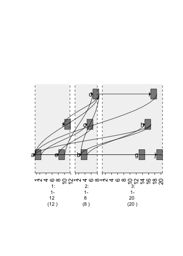

Vignette On Creating Heat maps and Graphs
======

**Creating a Graph to connect ranges**

.. sourcecode:: r
    

    ##create an N lengthed GRanges object that you want to have connections.
    gr <- GRanges(seqnames = Rle(c("chr1" , "chr2" , "chr1" , "chr3") ,
      c(1,3,2,4)), ranges = IRanges(c(1,3,5,7,9,11,13,15,17,19) , end =
          c(2,4,6,8,10,12,14,16,18,20), names = head(letters,10)), GC=seq(1,10,length=10), name=seq(5,10,length=10))
    ##print how it looks 
    print(gr)

::

    ## GRanges object with 10 ranges and 2 metadata columns:
    ##     seqnames    ranges strand |        GC             name
    ##        <Rle> <IRanges>  <Rle> | <numeric>        <numeric>
    ##   a     chr1  [ 1,  2]      * |         1                5
    ##   b     chr2  [ 3,  4]      * |         2 5.55555555555556
    ##   c     chr2  [ 5,  6]      * |         3 6.11111111111111
    ##   d     chr2  [ 7,  8]      * |         4 6.66666666666667
    ##   e     chr1  [ 9, 10]      * |         5 7.22222222222222
    ##   f     chr1  [11, 12]      * |         6 7.77777777777778
    ##   g     chr3  [13, 14]      * |         7 8.33333333333333
    ##   h     chr3  [15, 16]      * |         8 8.88888888888889
    ##   i     chr3  [17, 18]      * |         9 9.44444444444444
    ##   j     chr3  [19, 20]      * |        10               10
    ##   -------
    ##   seqinfo: 3 sequences from an unspecified genome; no seqlengths

.. sourcecode:: r
    

    ##create matrix to specify edges (links between nodes) and nodes are the ranges.
    
    ##create an N*N matrix filled with 0s.
    m = matrix(0 , nrow = 10 , ncol = 10)
    ##print how the matrix looks.
    m

::

    ##       [,1] [,2] [,3] [,4] [,5] [,6] [,7] [,8] [,9] [,10]
    ##  [1,]    0    0    0    0    0    0    0    0    0     0
    ##  [2,]    0    0    0    0    0    0    0    0    0     0
    ##  [3,]    0    0    0    0    0    0    0    0    0     0
    ##  [4,]    0    0    0    0    0    0    0    0    0     0
    ##  [5,]    0    0    0    0    0    0    0    0    0     0
    ##  [6,]    0    0    0    0    0    0    0    0    0     0
    ##  [7,]    0    0    0    0    0    0    0    0    0     0
    ##  [8,]    0    0    0    0    0    0    0    0    0     0
    ##  [9,]    0    0    0    0    0    0    0    0    0     0
    ## [10,]    0    0    0    0    0    0    0    0    0     0

.. sourcecode:: r
    

    ##the graph will be made by searching for coordinates in the matrix that have 1s.
    ##set indices to 1.
    m[1,3]=1
    m[1,10]=1
    m[2,5]=1
    m[2,8]=1
    m[3,5]=1
    m[4,1]=1
    m[4,2]=1
    m[4,6]=1
    m[4,9]=1
    m[5,1]=1
    m[5,2]=1
    m[5,4]=1
    m[8,1]=1
    m[8,2]=1
    m[9,1]=1
    m[10,1]=1

.. sourcecode:: r
    

    ##attach "m" to the edges parameter.
    plot(gTrack(gr , edges = m , stack.gap = 5))

    plot of chunk plot1 

.. sourcecode:: r
    

    ##plot(c(gTrack(gr , edges = a , stack.gap = 5) , gTrack(gr , mdata = m2 , stack.gap = 5)) , gr.sub(si , 'chr', ''))

