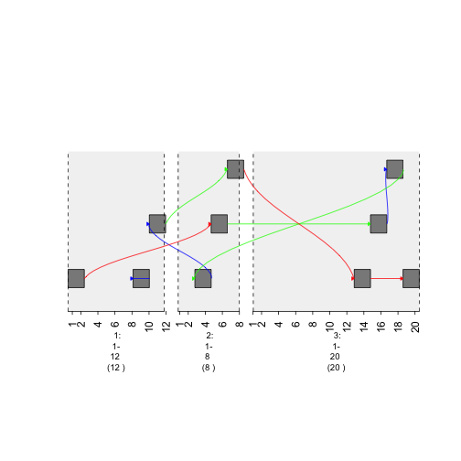
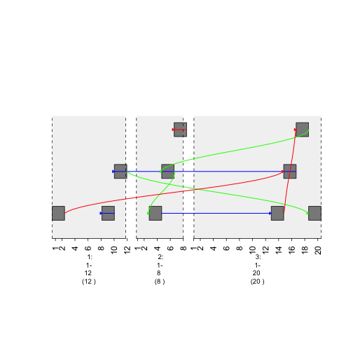
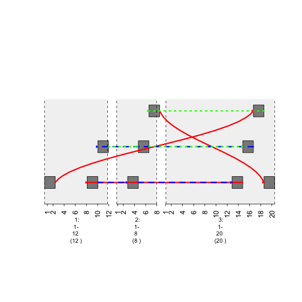
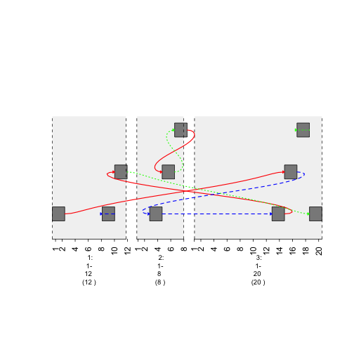

How to Create Graphs
=========================================

In certain situations, genes have been known to interact. For example, during chromosomal rearrangements, two genes may "swap" DNA. Graphing such a phenomenon is possible using gTrack. Additionally, the **edges** parameter will be utilized, helping users understand the context that in can be used. 

Edges Parameter
~~~~~~~~~~~~~~~

In order to create a connected graph in gTrack, the **edges** parameter of gTrack is supplied a matrix of connections.  

.. sourcecode:: r
    

    ##create an N lengthed GRanges object that you want to have connections.
    gr <- GRanges(seqnames = Rle(c("chr1" , "chr2" , "chr1" , "chr3") ,
      c(1,3,2,4)), ranges = IRanges(c(1,3,5,7,9,11,13,15,17,19) ,
      end = c(2,4,6,8,10,12,14,16,18,20),
      names = head(letters,10)),
      GC=seq(1,10,length=10),
      name=seq(5,10,length=10))
    
    ##print how it looks 
    print(gr)

::

    ## GRanges object with 10 ranges and 2 metadata columns:
    ##     seqnames    ranges strand |        GC             name
    ##        <Rle> <IRanges>  <Rle> | <numeric>        <numeric>
    ##   a     chr1  [ 1,  2]      * |         1                5
    ##   b     chr2  [ 3,  4]      * |         2 5.55555555555556
    ##   c     chr2  [ 5,  6]      * |         3 6.11111111111111
    ##   d     chr2  [ 7,  8]      * |         4 6.66666666666667
    ##   e     chr1  [ 9, 10]      * |         5 7.22222222222222
    ##   f     chr1  [11, 12]      * |         6 7.77777777777778
    ##   g     chr3  [13, 14]      * |         7 8.33333333333333
    ##   h     chr3  [15, 16]      * |         8 8.88888888888889
    ##   i     chr3  [17, 18]      * |         9 9.44444444444444
    ##   j     chr3  [19, 20]      * |        10               10
    ##   -------
    ##   seqinfo: 3 sequences from an unspecified genome; no seqlengths

.. sourcecode:: r
    

    ##create matrix to specify edges (links between nodes) and nodes are the ranges.
    
    ##create an N*N matrix filled with 0s.
    graph = matrix(0 , nrow = 10 , ncol = 10)
    ##print how the matrix looks.
    graph

::

    ##       [,1] [,2] [,3] [,4] [,5] [,6] [,7] [,8] [,9] [,10]
    ##  [1,]    0    0    0    0    0    0    0    0    0     0
    ##  [2,]    0    0    0    0    0    0    0    0    0     0
    ##  [3,]    0    0    0    0    0    0    0    0    0     0
    ##  [4,]    0    0    0    0    0    0    0    0    0     0
    ##  [5,]    0    0    0    0    0    0    0    0    0     0
    ##  [6,]    0    0    0    0    0    0    0    0    0     0
    ##  [7,]    0    0    0    0    0    0    0    0    0     0
    ##  [8,]    0    0    0    0    0    0    0    0    0     0
    ##  [9,]    0    0    0    0    0    0    0    0    0     0
    ## [10,]    0    0    0    0    0    0    0    0    0     0

.. sourcecode:: r
    

    ##the graph will be made by searching for coordinates in the matrix that have 1s.
    ##set indices to 1.
    graph[1,3]=1
    graph[1,10]=1
    graph[2,5]=1
    graph[2,8]=1
    graph[3,5]=1
    graph[4,1]=1
    graph[4,2]=1
    graph[4,6]=1
    graph[4,9]=1
    graph[5,1]=1
    graph[5,2]=1
    graph[5,4]=1
    graph[8,1]=1
    graph[8,2]=1
    graph[9,1]=1
    graph[10,1]=1

.. sourcecode:: r
    

    ##use edges parameter to create graph. 
    plot(gTrack(gr , edges = graph , stack.gap = 5))

.. figure:: figure/plot1 -1.png
    :alt: plot of chunk plot1 

    plot of chunk plot1 

Adding **styles** to a graph

If a **matrix** is used to create a graph, color and style of edges can't be specified.Instead of using a **matrix** use a **data frame** to specify those attributes. 

.. sourcecode:: r
    

    ##from column specifies the beginning node (range)
    ##to column specifies the end node (range)
    ##col specifies the color of the edge 
    graph = data.frame(from = 1:9, to = c(6,9,7,2,4,10,8,5,3) , col = c('red', 'blue', 'green'))

.. sourcecode:: r
    

    plot(gTrack(gr , edges = graph , stack.gap = 5))

    plot of chunk colored-graph

Time to change the **width** of the graph by **lwd** parameter. 

.. sourcecode:: r
    

    ## lwd column specifies the width of the edge 
     graph$lwd = 1.844941
     graph

::

    ##   from to   col      lwd
    ## 1    1  6   red 1.844941
    ## 2    2  9  blue 1.844941
    ## 3    3  7 green 1.844941
    ## 4    4  2   red 1.844941
    ## 5    5  4  blue 1.844941
    ## 6    6 10 green 1.844941
    ## 7    7  8   red 1.844941
    ## 8    8  5  blue 1.844941
    ## 9    9  3 green 1.844941

.. sourcecode:: r
    

    plot(gTrack(gr, edges = graph, stack.gap = 5))

    plot of chunk width-graph

Change style of edge by **lty** parameter. 

.. sourcecode:: r
    

    ## lty specifies the style of the edge (no dashes, big dashes, little dashes)
    graph$lty = c(1,2,3)

.. sourcecode:: r
    

    plot(gTrack(gr , edges = graph , stack.gap = 5))

    plot of chunk style-graph

Increase **"curviness"** of the edges by adding **h** column

.. sourcecode:: r
    

    graph$h = 10

.. sourcecode:: r
    

    plot(gTrack(gr , edges = graph , stack.gap = 5))

    plot of chunk curviness-graph

**Combining the heat map and graph onto the same plot.Possible by concatenation**

.. sourcecode:: r
    

    plot(c(gTrack(gr , edges = graph, stack.gap = 5) , gTrack(gr , mdata = heatMap , stack.gap = 5)))

::

    ## Error in listify(mdata, matrix, length(.Object@data)): object 'heatMap' not found

**Zooming** in and out

.. sourcecode:: r
    

    ##firstly, in previous examples, the seqnames have been 'chr1', 'chr2', etc. But, in order to avoid ALL possible errors the seqnames should be 1,2,etc.
    ##can easily change an existing GRanges object to fit that criteria.
    ##gr.fix will find the largest coordinate for each seqname and subsequently save those values in seqlengths parameter 
    gr.fix(gr)

::

    ## GRanges object with 10 ranges and 2 metadata columns:
    ##     seqnames    ranges strand |        GC             name
    ##        <Rle> <IRanges>  <Rle> | <numeric>        <numeric>
    ##   a     chr1  [ 1,  2]      * |         1                5
    ##   b     chr2  [ 3,  4]      * |         2 5.55555555555556
    ##   c     chr2  [ 5,  6]      * |         3 6.11111111111111
    ##   d     chr2  [ 7,  8]      * |         4 6.66666666666667
    ##   e     chr1  [ 9, 10]      * |         5 7.22222222222222
    ##   f     chr1  [11, 12]      * |         6 7.77777777777778
    ##   g     chr3  [13, 14]      * |         7 8.33333333333333
    ##   h     chr3  [15, 16]      * |         8 8.88888888888889
    ##   i     chr3  [17, 18]      * |         9 9.44444444444444
    ##   j     chr3  [19, 20]      * |        10               10
    ##   -------
    ##   seqinfo: 3 sequences from an unspecified genome

.. sourcecode:: r
    

    ##seqinfo will return the seqlengths for each seqname
    seqinfo(gr)

::

    ## Seqinfo object with 3 sequences from an unspecified genome; no seqlengths:
    ##   seqnames seqlengths isCircular genome
    ##   chr1             NA         NA   <NA>
    ##   chr2             NA         NA   <NA>
    ##   chr3             NA         NA   <NA>

.. sourcecode:: r
    

    ##si2gr (a gUtils function) will generate and then return a GRanges object from the seqlength values
    si2gr(gr)

::

    ## GRanges object with 3 ranges and 0 metadata columns:
    ##        seqnames    ranges strand
    ##           <Rle> <IRanges>  <Rle>
    ##   chr1     chr1    [1, 0]      +
    ##   chr2     chr2    [1, 0]      +
    ##   chr3     chr3    [1, 0]      +
    ##   -------
    ##   seqinfo: 3 sequences from an unspecified genome; no seqlengths

.. sourcecode:: r
    

    ##putting these functions together, a range for each seqname will be available and arithmetic operations can be done to it and zooming is then possible.
    si = si2gr(seqinfo(gr.fix(gr)))
    
    ##last step: replace all 'chr' strings in GRanges with an empty string.
    options(warn=-1)
    plot(c(gTrack(gr , edges = graph, stack.gap = 5) , gTrack(gr , mdata = heatMap, stack.gap = 5)) , gr.sub(si , 'chr' , '' )+20)

::

    ## Error in listify(mdata, matrix, length(.Object@data)): object 'heatMap' not found

