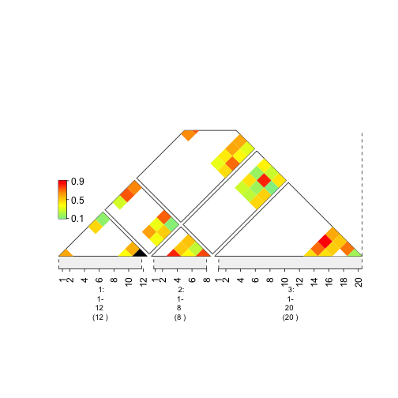
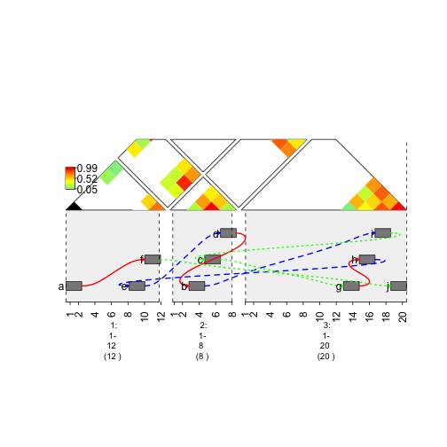
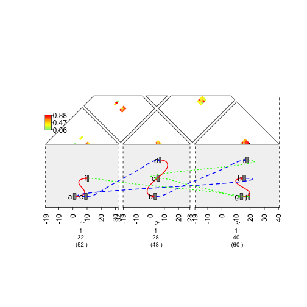

How to Create Heat Maps
=======================

gTrack is able to create heat graphs and in this vignette, the steps to make one will be shown. In order to create one the **mdata** parameter of gTrack must be supplied a matrix.

mdata Parameter
~~~~~~~~~~~~~~~

.. sourcecode:: r
    

    ## In order to create a heat map for each node in the matrix, color intensity needs to be specified.
    ## To illustrate, a random N*N matrix filled with values from 1:100 is used, but first a GRanges object is made.
    
    ##create an N lengthed GRanges object that you want to have connections.
    gr <- GRanges(seqnames = Rle(c("chr1" , "chr2" , "chr1" , "chr3") ,c(1,3,2,4)), ranges = IRanges(c(1,3,5,7,9,11,13,15,17,19) ,end = c(2,4,6,8,10,12,14,16,18,20), names = head(letters,10)),GC=seq(1,10,length=10), name=seq(5,10,length=10))
    heatMap = matrix(runif(length(gr)^2), nrow = 10, ncol = 10)

.. sourcecode:: r
    

     plot(gTrack(gr, mdata = heatMap, stack.gap = 5))

    plot of chunk plotheatmap
.. sourcecode:: r
    

    ## It is also possible to add multiple plots to the same window. Use the concatenation operator.
     plot(c(gTrack(gr, edges = graph, stack.gap = 5), gTrack(gr, mdata = heatMap, stack.gap = 5)))

    plot of chunk plotheatmap

Zooming In and Out of a Graph
~~~~~~~~~~~~~~~~~~~~~~~~~~~~~

.. sourcecode:: r
    

    ## In order to zoom in and out, essentially the ranges of the sequences need to be stretched or shrinked.
    ## Firstly, in upstream code, the "seqnames" field of the GRanges object was supplied character vectors. The problem that arises is that the seqlengths of the GRanges object cannot be implicitly determined.
    ## gUtils can easily fix a GRanges object so that the seqlengths is properly set.
    ## Use the gr.fix function. It will find the largest coordinate for each seqname and subsequently save those values in the seqlengths parameter.
     gr <- gr.fix(gr)
    
    ## create the window for the plot.
     si = si2gr(seqinfo(gr.fix(gr)))

.. sourcecode:: r
    

    plot(c(gTrack(gr , edges = graph, stack.gap = 5) , gTrack(gr , mdata = heatMap, stack.gap = 5)) , gr.sub(si , 'chr' , '' )+20)

    plot of chunk zoomedOutGraph
