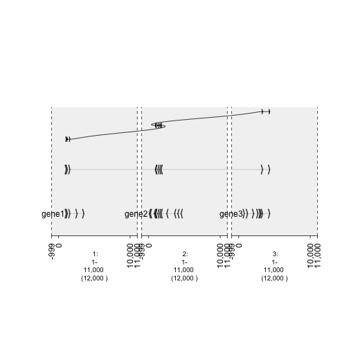

How to Graph Relationships in The Genome 
=========================================================

Genes interact with each other and gTrack is perfect in graphing these interactions. 

In this vignette, the **draw.paths** and **gr.labelfield** and **circle** parameters of gTrack will be highlighted. They will be used in graphing the variants of a random collection of sequences. These examples will use the GRangesList functionality provided by GenomicRanges.

Parameters Tutorial
~~~~~~~~~~~~~~~~~~~

To simulate the draw.paths and gr.labelfield parameters, a GRangesList storing RANDOM sequences from chromosomes 1,2, and 3 will be created. Then, a graph will be shown when draw.paths is supplied and when it is not. Similarily will be done for the gr.labelfield parameter. 

.. sourcecode:: r
    

    gene1 = sort(sample(gr.tile(parse.gr('1:1-5e3+'), 50), 5))

::

    ## Error in (function (classes, fdef, mtable) : unable to find an inherited method for function 'values<-' for signature '"GRanges"'

.. sourcecode:: r
    

    gene2 = rev(sort(sample(gr.tile(parse.gr('2:1-5e3-'), 50), 12)))

::

    ## Error in (function (classes, fdef, mtable) : unable to find an inherited method for function 'values<-' for signature '"GRanges"'

.. sourcecode:: r
    

    gene3 = sort(sample(gr.tile(parse.gr('3:1-5e3+'), 50), 8))

::

    ## Error in (function (classes, fdef, mtable) : unable to find an inherited method for function 'values<-' for signature '"GRanges"'

.. sourcecode:: r
    

    ##Create a column that keeps track of the exons
    
    gene1$exon = 1:length(gene1)
    gene2$exon = 1:length(gene2)
    gene3$exon = 1:length(gene3)
    
    ## Combine into GRangesList
    grl = GRangesList(gene1 = gene1, gene2 = gene2, gene3 = gene3)
    
    gt.genes = gTrack(grl)

::

    ## Warning in `[<-`(`*tmp*`, null.ix, value = list(<S4 object of class
    ## structure("GRangesList", package = "GenomicRanges")>)): implicit list
    ## embedding of S4 objects is deprecated

.. sourcecode:: r
    

    ## Plot but, show how **effective** draw.paths and gr.labelfield can be.
    fusion = GRangesList(c(grl$gene1[1:3], grl$gene2[5:9], grl$gene3[7:8]))
    gt.fusion = gTrack(fusion, draw.paths = FALSE, gr.labelfield = 'exon')

::

    ## Warning in `[<-`(`*tmp*`, null.ix, value = list(<S4 object of class
    ## structure("GRangesList", package = "GenomicRanges")>)): implicit list
    ## embedding of S4 objects is deprecated

.. sourcecode:: r
    

    gt.fusion.o = gTrack(fusion, draw.paths = TRUE, gr.labelfield = 'exon')

::

    ## Warning in `[<-`(`*tmp*`, null.ix, value = list(<S4 object of class
    ## structure("GRangesList", package = "GenomicRanges")>)): implicit list
    ## embedding of S4 objects is deprecated

.. sourcecode:: r
    

    ## separating the windows for the graph. 
    win = gUtils::parse.gr(c('1:1-1e4', '2:1-1e4', '3:1-1e4'))

::

    ## Warning in hg_seqlengths(): hg_seqlengths: supply genome
    ## seqlengths or set default with env variable DEFAULT_BSGENOME (e.g.
    ## Sys.setenv(DEFAULT_BSGENOME = "BSgenome.Hsapiens.UCSC.hg19::Hsapiens").
    ## DEFAULT_BSGENOME can also be set to a path or URL of a tab delimited text
    ## *.chrom.sizes file

.. sourcecode:: r
    

    plot(c(gt.genes, gt.fusion, gt.fusion.o), win +1e3)

::

    ## Warning in `[<-`(`*tmp*`, null.ix, value = list(<S4 object of class
    ## structure("GRangesList", package = "GenomicRanges")>, : implicit list
    ## embedding of S4 objects is deprecated

    plot of chunk -plotList

Graping Copy Number Variations
~~~~~~~~~~~~~~~~~~~~~~~~~~~~~~

To **highlight** regions that are copy number variations, we first need to create genes. Once those genes are made, a few sequences will be selected as variants. This data will be graphed and because there are outliers (variants), they will be easily visable. This vignette also highlights examples of how/when to use the gTrack **stack.gap** parameter.  

.. sourcecode:: r
    

    ## Create a GRanges
    fake.genome = c('1'=1e4, '2'=1e3, '3'=5e3)
    tiles = gr.tile(fake.genome, 1)
    
    ## Choose 5 random indices 
    hotspots = sample(length(tiles), 5)
    
    d = values(distanceToNearest(tiles, tiles[hotspots]))$distance

::

    ## Error in (function (classes, fdef, mtable) : unable to find an inherited method for function 'values' for signature '"SortedByQueryHits"'

.. sourcecode:: r
    

    prob = .05 + exp(-d^2/10000)

::

    ## Error in eval(expr, envir, enclos): object 'd' not found

.. sourcecode:: r
    

    mut = sample(tiles, 2000, prob = prob, replace = TRUE) 

::

    ## Error in sample.int(length(x), size, replace, prob): object 'prob' not found

.. sourcecode:: r
    

    win = si2gr(fake.genome)
    
    gt.mut0 = gTrack(mut, circle = TRUE, stack.gap = 0)

::

    ## Error in listify(data, GRanges): object 'mut' not found

.. sourcecode:: r
    

    gt.mut2 = gTrack(mut, circle = TRUE, stack.gap = 2)

::

    ## Error in listify(data, GRanges): object 'mut' not found

.. sourcecode:: r
    

    gt.mut10 = gTrack(mut, circle = TRUE, stack.gap = 10)

::

    ## Error in listify(data, GRanges): object 'mut' not found

.. sourcecode:: r
    

    gt.mut50 = gTrack(mut, circle = TRUE, stack.gap = 50)

::

    ## Error in listify(data, GRanges): object 'mut' not found

.. sourcecode:: r
    

    plot(c(gt.mut0, gt.mut2, gt.mut10, gt.mut50), win)

::

    ## Error in plot(c(gt.mut0, gt.mut2, gt.mut10, gt.mut50), win): object 'gt.mut0' not found

