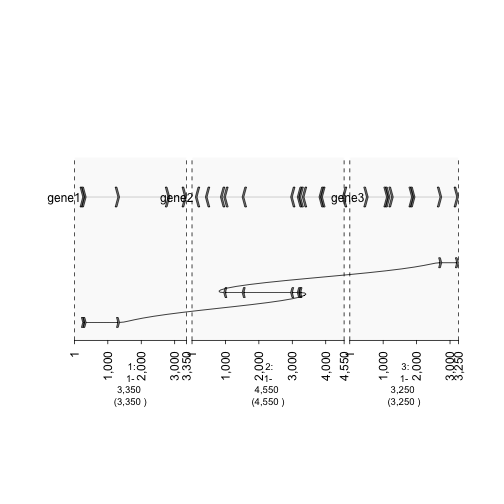

Graphing Mutations
==================

**Draw.paths**

.. sourcecode:: r
    

    ## To create fake genes, create two GRanges objects each filled with random ranges from chromosomes 1 and 2. Ranges fall within the 1-5e3 sequence
    
    gene1 = sort(sample(gr.tile(parse.gr('1:1-5e3+'), 50), 5))
    gene2 = rev(sort(sample(gr.tile(parse.gr('2:1-5e3-'), 50), 12)))
    gene3 = sort(sample(gr.tile(parse.gr('3:1-5e3+'), 50), 8))
    
    ## Combine into GRangesList
    grl = GRangesList(gene1 = gene1, gene2 = gene2, gene3 = gene3)
    gt.genes = gTrack(grl)
    
    ## Subset GRangesList and plot but, connect ranges using draw.paths
    fusion = GRangesList(c(grl$gene1[1:3], grl$gene2[5:9], grl$gene3[7:8]))
    gt.fusion = gTrack(fusion, draw.paths = TRUE)

.. sourcecode:: r
    

    plot(c(gt.fusion, gt.genes))

    plot of chunk -plotPaths

