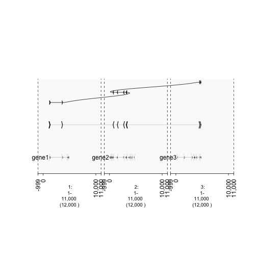
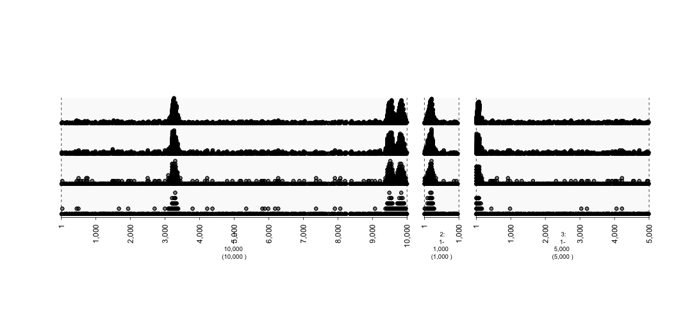

How to Graph Relationships in The Genome 
=========================================================

Genes interact with each other, either on purpose such as during epistasis or not such as during DNA rearrangement in solid tumors. Both circumstances may wish to be graphed and gTrack can perform such a task.

In this vignette, the **draw.paths** and **gr.labelfield** and **circle** parameters of gTrack will be highlighted. In addition, variants of a random collection of sequences will be graphed. These examples will use the GRangesList functionality provided by GenomicRanges.

Parameters Tutorial
~~~~~~~~~~~~~~~~~~~

To simulate the draw.paths and gr.labelfield parameters, a GRangesList storing sequences from chromosomes 1,2, and 3 will be created. Then, a graph will be shown when draw.paths is supplied and when it is not. Similarily will be done for the gr.labelfield parameter. 

.. sourcecode:: r
    

    gene1 = sort(sample(gr.tile(parse.gr('1:1-5e3+'), 50), 5))
    gene2 = rev(sort(sample(gr.tile(parse.gr('2:1-5e3-'), 50), 12)))
    gene3 = sort(sample(gr.tile(parse.gr('3:1-5e3+'), 50), 8))
    
    ##Create a column that keeps track of the exons
    
    gene1$exon = 1:length(gene1)
    gene2$exon = 1:length(gene2)
    gene3$exon = 1:length(gene3)
    
    ## Combine into GRangesList
    grl = GRangesList(gene1 = gene1, gene2 = gene2, gene3 = gene3)
    
    gt.genes = gTrack(grl)
    
    ## Plot but, show how **effective** draw.paths and gr.labelfield can be.
    fusion = GRangesList(c(grl$gene1[1:3], grl$gene2[5:9], grl$gene3[7:8]))
    gt.fusion = gTrack(fusion, draw.paths = FALSE, gr.labelfield = 'exon')
    gt.fusion.o = gTrack(fusion, draw.paths = TRUE, gr.labelfield = 'exon')
    
    ## separating the windows for the graph. 
    win = parse.gr(c('1:1-1e4', '2:1-1e4', '3:1-1e4'))

.. sourcecode:: r
    

    plot(c(gt.genes, gt.fusion, gt.fusion.o), win +1e3)

    plot of chunk -plotList

Graphing Variants Tutorial
~~~~~~~~~~~~~~~~~~~~~~~~~~

## To simulate mutations, we first need to create genes. Once those genes are made, a few sequences will be selected as variants. Their "strange" data will be graphed and because they are outliers, they will be easily visable. This vignette also highlights examples of how/when to use the following gTrack parameters: draw.paths, gr.labelfield.  

.. sourcecode:: r
    

    ## Create a GRanges
    fake.genome = c('1'=1e4, '2'=1e3, '3'=5e3)
    tiles = gr.tile(fake.genome, 1)
    
    ## Choose 5 random indices 
    hotspots = sample(length(tiles), 5)
    
    d = values(distanceToNearest(tiles, tiles[hotspots]))$distance
    prob = .05 + exp(-d^2/10000)

.. sourcecode:: r
    

    mut = sample(tiles, 2000, prob = prob, replace = TRUE) 
    
    print(mut)

::

    ## GRanges object with 2000 ranges and 2 metadata columns:
    ##          seqnames       ranges strand   |  query.id   tile.id
    ##             <Rle>    <IRanges>  <Rle>   | <integer> <integer>
    ##      [1]        3 [2736, 2736]      +   |         3     13736
    ##      [2]        3 [2386, 2386]      +   |         3     13386
    ##      [3]        1 [5550, 5550]      +   |         1      5550
    ##      [4]        2 [ 925,  925]      +   |         2     10925
    ##      [5]        1 [1266, 1266]      +   |         1      1266
    ##      ...      ...          ...    ... ...       ...       ...
    ##   [1996]        1 [9548, 9548]      +   |         1      9548
    ##   [1997]        1 [9526, 9526]      +   |         1      9526
    ##   [1998]        3 [3072, 3072]      +   |         3     14072
    ##   [1999]        1 [ 446,  446]      +   |         1       446
    ##   [2000]        2 [ 487,  487]      +   |         2     10487
    ##   -------
    ##   seqinfo: 3 sequences from an unspecified genome

.. sourcecode:: r
    

    win = si2gr(fake.genome)
    
    gt.mut0 = gTrack(mut, circle = TRUE, stack.gap = 0)
    gt.mut2 = gTrack(mut, circle = TRUE, stack.gap = 2)
    gt.mut10 = gTrack(mut, circle = TRUE, stack.gap = 10)
    gt.mut50 = gTrack(mut, circle = TRUE, stack.gap = 50)

.. sourcecode:: r
    

    plot(c(gt.mut0, gt.mut2, gt.mut10, gt.mut50), win)

    plot of chunk mutations2-plot

