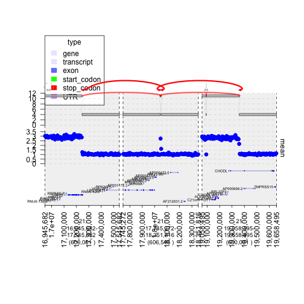

How to Graph Structural Variations
=====================================

.. sourcecode:: r
    

    ## make sure to load in these libraries
    library(gTrack)
    library(bamUtils) ## to use read.bam function 

.. sourcecode:: r
    

    options(warn=-1)
    ## this load sequences that have had coverage calculated from cancer cell lines (GRanges object, have to make into a gTrack)
    cov = readRDS('../../inst/extdata/coverage.rds')
    
    ## wrap a gTrack around this, draw with blue circles, and label the track "Cov" and sets 0 as lower bound for all views 
    gt.cov = gTrack(cov, y.field = 'mean', circles = TRUE, col = 'blue', name = 'Cov')
    
    ## this loads the junctions data from the cell line (GRangesList, where each item is a length 2 GRanges
    ## with strand information specifying the two locations and strands that are being fused) 
    junctions = readRDS('../../inst/extdata/junctions.rds')
    
    ## loading the GENCODE gene model gTrack (hg19 pre-loaded comes with gTrack,
    ## but can be made from any .gff file from GENCODE (http://www.gencodegenes.org/releases/19.html)
    gt.ge = track.gencode()

::

    ## Pulling gencode annotations from /Library/Frameworks/R.framework/Versions/3.3/Resources/library/gTrack/extdata/gencode.composite.collapsed.rds

.. sourcecode:: r
    

    ## this loads a gTrack object of a genome graph i.e. network of the same cancer cell line (generated by JaBba)
    graph = readRDS('../../inst/extdata/graph.rds')
    
    ## pick an interesting junction and plot the genes, coverage, and genome graph around it
    ## the links argument specifies the junctions that are being drawn
    window = junctions[[290]] + 1e5

.. sourcecode:: r
    

    plot(c(gt.ge, gt.cov, graph), window, links = junctions)

.. figure:: figure/plot-firstSV-1.png
    :alt: plot of chunk plot-firstSV

    plot of chunk plot-firstSV

.. sourcecode:: r
    

    ix = 194
    cwindow = junctions[[ix]]
    
    jix = c(582, 583)
    window = unlist(junctions[jix]) + 3e5
    
    ## convert junctions to a data frame. values() returns values from the hash which is the junctions object, in this example.
    values(junctions)$col = 'gray'
    values(junctions)$lwd = 1
    values(junctions)$lty = 2 ## dashed instead of dotted line style
    values(junctions)$col[jix] = 'red'
    values(junctions)$lwd[jix] = 3 ## thicker line width
    values(junctions)$lty[jix] = 1 ## solid line style for junction of interest

.. sourcecode:: r
    

    plot(c(gt.ge, gt.cov, graph), window, links = junctions)

    plot of chunk plot2ndgraph

Graping BAM data
~~~~~~~~~~~~~~~~

.. sourcecode:: r
    

    ## 4 windows corresponding to the 4 breakpoints involved in these two rearrangements.
    window = unlist(junctions[jix]) + 250
    
    ## pull the reads out in these windows from the tumor and normal bam file.
    treads = read.bam("../../files/tumor.bam", window)

::

    ## Error in value[[3L]](cond): failed to open BamFile: file(s) do not exist:
    ##   '../../files/tumor.bam'

.. sourcecode:: r
    

    nreads = read.bam("../../files/normal.bam", window)

::

    ## Error in value[[3L]](cond): failed to open BamFile: file(s) do not exist:
    ##   '../../files/normal.bam'

.. sourcecode:: r
    

    ## make them into gTracks
    td.treads = gTrack(treads, draw.var = TRUE, name = 'Tumor reads')
    td.nreads = gTrack(nreads, draw.var = TRUE, name = 'Normal reads')

.. sourcecode:: r
    

    plot(c(gt.ge, td.nreads, td.treads), window, links = junctions)

.. figure:: figure/graph_BAM_data-1.png
    :alt: plot of chunk graph_BAM_data

    plot of chunk graph_BAM_data
