Customizing a Small Data Set
===============================

In this vignette, examples of how to segment a data set such as a single GRanges object, how to specify the y-axis of a graph, how to color that same graph, how to add a color to each unique value will be shown. 

gr.tile(gr , w) - Divide GRanges into tiles of length "w"
~~~~~~~~~~~~~~~~~~~~~~~~~~~~~~~~~~~~~~~~~~~~~~~~~~~~~~~~

.. sourcecode:: r
    

    #The only interval in this GRanges object has a range of length 100, it'll be divided by 5 and thus, 20 tiles of length 5 will be returned.
    gr <- gr.tile(GRanges(1, IRanges(1,100)), w=5)

.. sourcecode:: r
    

    ## Plot tiles 
    plot(gTrack(gr))

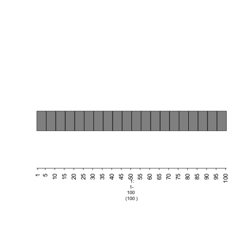

    plot of chunk plot-tiles

gTrack(gr + n) - specify degree of overlap
~~~~~~~~~~~~~~~~~~~~~~~~~~~~~~~~~~~~
 

.. sourcecode:: r
    

    plot(gTrack(gr+7))

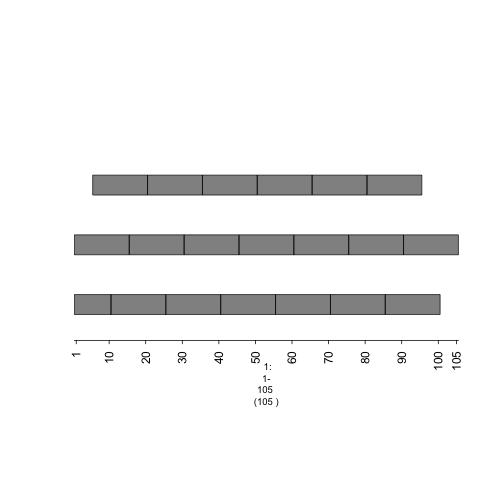

    plot of chunk plot-overlappingtiles

**stack.gap**

**vector or scaler numeric specifiying x gap between stacking non-numeric GRanges or GRangesLists items in track(s).**

.. sourcecode:: r
    

    gr <- GRanges(seqnames = Rle(c("chr1" , "chr2" , "chr1" , "chr3") ,
      c(1,3,2,4)), ranges = IRanges(c(1,3,5,7,9,11,13,15,17,19) , end =
        c(2,4,6,8,10,12,14,16,18,20), names = head(letters,10)), GC=seq(1,10,length=10), name=seq(5,10,length=10))
    print(gr)

::

    ## GRanges object with 10 ranges and 2 metadata columns:
    ##     seqnames    ranges strand |        GC             name
    ##        <Rle> <IRanges>  <Rle> | <numeric>        <numeric>
    ##   a     chr1  [ 1,  2]      * |         1                5
    ##   b     chr2  [ 3,  4]      * |         2 5.55555555555556
    ##   c     chr2  [ 5,  6]      * |         3 6.11111111111111
    ##   d     chr2  [ 7,  8]      * |         4 6.66666666666667
    ##   e     chr1  [ 9, 10]      * |         5 7.22222222222222
    ##   f     chr1  [11, 12]      * |         6 7.77777777777778
    ##   g     chr3  [13, 14]      * |         7 8.33333333333333
    ##   h     chr3  [15, 16]      * |         8 8.88888888888889
    ##   i     chr3  [17, 18]      * |         9 9.44444444444444
    ##   j     chr3  [19, 20]      * |        10               10
    ##   -------
    ##   seqinfo: 3 sequences from an unspecified genome; no seqlengths

.. sourcecode:: r
    

    plot(gTrack(gr))

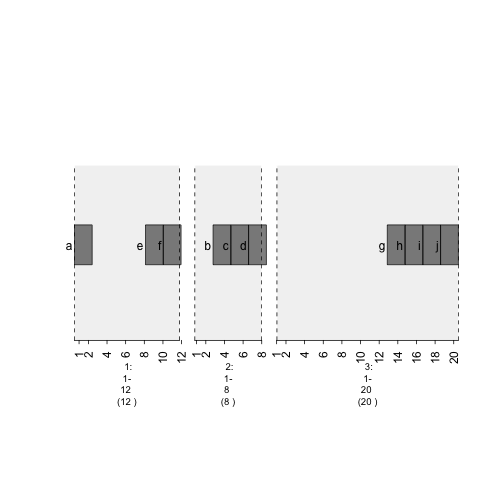

    plot of chunk plot-gr

.. sourcecode:: r
    

    plot(gTrack(gr , stack.gap = 2))

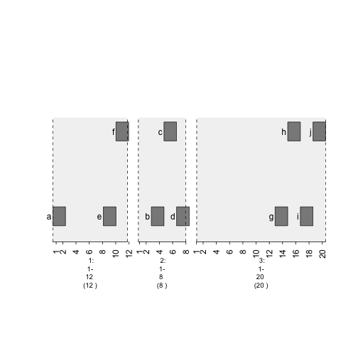

    plot of chunk plot-stack.gap2

.. sourcecode:: r
    

    plot(gTrack(gr , stack.gap = 3))

.. figure:: figure/plot-stack.gap3-1.png
    :alt: plot of chunk plot-stack.gap3

    plot of chunk plot-stack.gap3

**gTrack(gr , y.field = 'GC')**

**vector or scalar numeric specifiying gap between tracks (add a dimension to the data)**

.. sourcecode:: r
    

    plot(gTrack(gr , y.field = 'GC'))

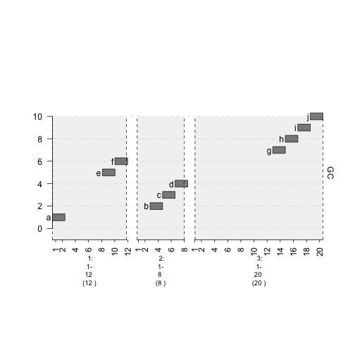

    plot of chunk plot-y.fieldGC

**gTrack(gr , bars = TRUE/FALSE)**

.. sourcecode:: r
    

    plot(gTrack(gr , y.field = 'GC' , bars = TRUE , col = 'light blue'))

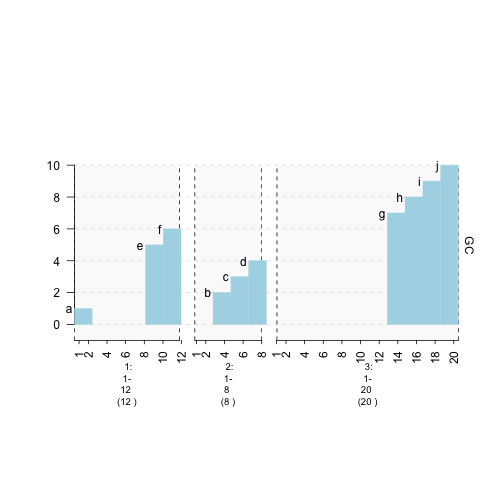

    plot of chunk plot-bars

**gTrack(gr , lines = TRUE/FALSE)**

.. sourcecode:: r
    

    plot(gTrack(gr , y.field = 'GC' , lines = TRUE , col = 'purple'))

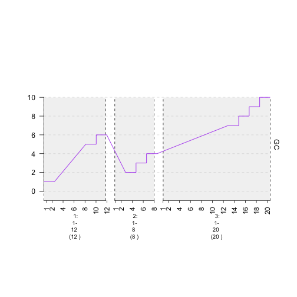

    plot of chunk plot-lines

**gTrack(gr , circles = TRUE/FALSE)**

.. sourcecode:: r
    

    plot(gTrack(gr , y.field = 'GC' , circles = TRUE , col = 'magenta' , border = '60'))

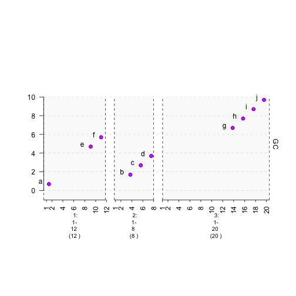

    plot of chunk plot-circles

**colorfield**

**map values to colors! Legend is automatically added**

.. sourcecode:: r
    

    plot(gTrack(gr , y.field = 'GC' , bars = TRUE , col = NA , colormaps = list(GC = c("1"="red" , "2" = "blue" , "3"="magenta", "4"="light blue" ,"5"="black" , "6"="green", "7"="brown" , "8"="pink", "9"="yellow", "10" = "orange")) ))

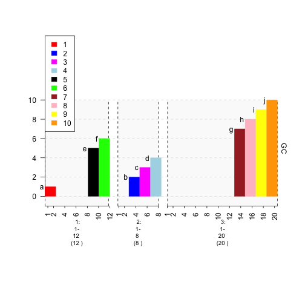

    plot of chunk plot-colorfield

**gr.colorfield**

.. sourcecode:: r
    

    plot(gTrack(gr , y.field = 'GC' , bars = TRUE , col = NA , gr.colorfield = 'GC'))

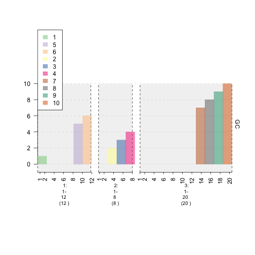

    plot of chunk plot-gr.colorfield

**gr.labelfield**

.. sourcecode:: r
    

    plot(gTrack(gr , y.field = 'GC' , bars = TRUE , col = NA , gr.colorfield = 'GC' , gr.labelfield = 'name'))

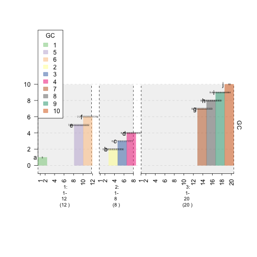

    plot of chunk plot-labelfield

**GRangesList**

.. sourcecode:: r
    

    # first, create GRanges object for chroms 1-3. Each chrom stores regions of exons
    chrom1 <- GRanges(seqnames=Rle(rep(1,5)) , ranges = IRanges(c(13214448,13377047,17190862,17284920,30741950) , end=c(13376489,17190004,17283075,30741656,30745210)))
    chrom2 <- GRanges(seqnames=Rle(rep(2,5)) , ranges = IRanges(c(34675467,34737163,50880025,50882016,51098931) , end = c(34737057,50879519,50880979,51089715,51099793)))
    chrom3 <- GRanges(seqnames=Rle(rep(3,5)) , ranges = IRanges(c(5883026,5888521,6651128,6655078,10251906) , end = c(5887648,6646543,6653332,10245198,10254797)))
    chroms <- GRangesList("chrom1" = chrom1 , "chrom2" = chrom2 , "chrom3" = chrom3)

